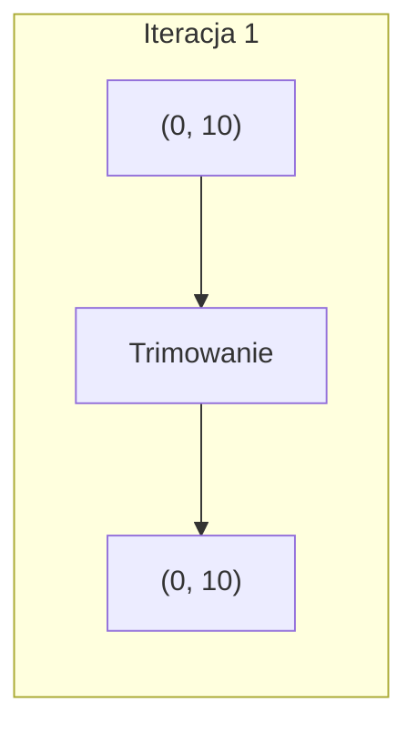
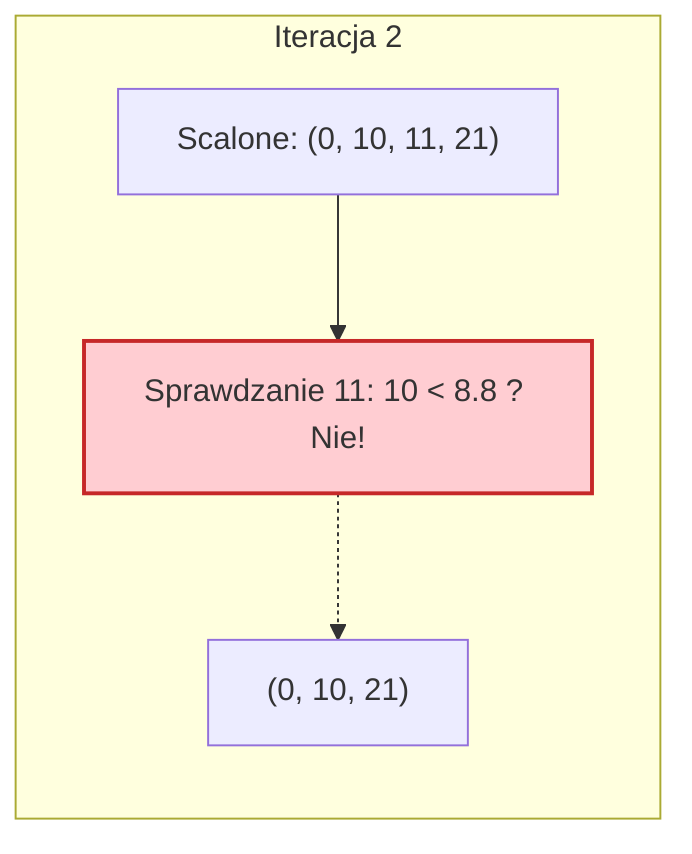
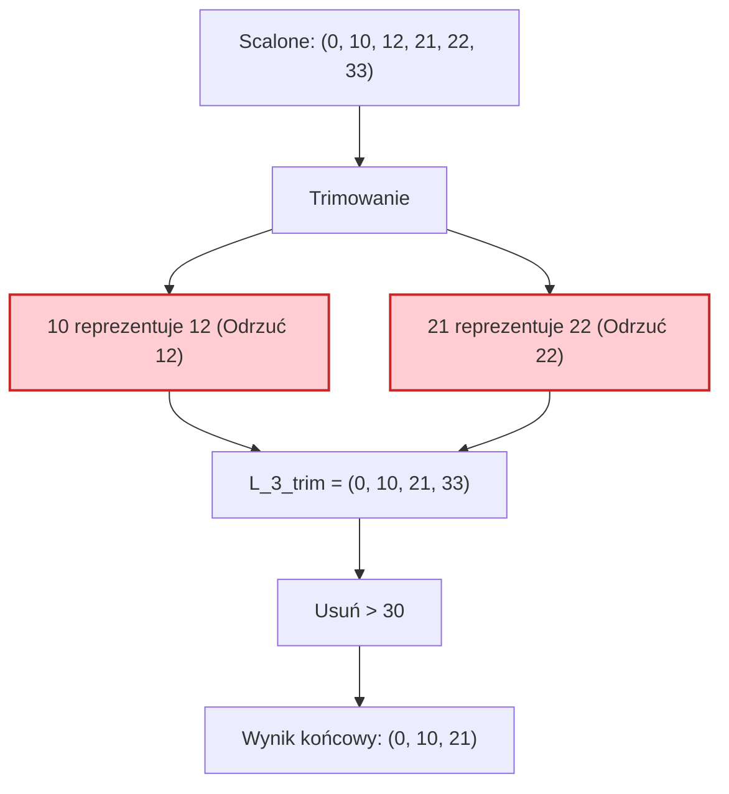

# Algorytm Approx-Subset-Sum (Aproksymacyjna suma podzbioru)

> [!abstract] Cel egzaminacyjny
> Umiem wyjaśnić działanie algorytmu i przejść go krok po kroku na konkretnych danych.

## Problem

**Wejście:** Zbiór dodatnich liczb całkowitych $S = \{x_1, x_2, ..., x_n\}$, docelowa wartość (limit) $t$ oraz parametr dokładności $\epsilon \in (0, 1)$.
**Wyjście:** Suma elementów pewnego podzbioru, która jest mniejsza lub równa $t$, a jej wartość nie odbiega od rozwiązania optymalnego o więcej niż współczynnik $(1 - \epsilon)$.
**Co algorytm ma znaleźć / policzyć / skonstruować:** Dobre (wystarczająco bliskie ideałowi) rozwiązanie problemu sumy podzbioru. Robi to po to, aby uniknąć wykładniczego czasu działania ($O(2^n)$) obecnego w algorytmie dokładnym. Jest to tzw. FPTAS (W pełni wielomianowy schemat aproksymacyjny).

## Idea

1. Algorytm działa niemal identycznie jak `Exact-Subset-Sum` – w każdej iteracji dodaje nowy element do poprzedniej listy sum i scala obie listy.
2. Różnica polega na zastosowaniu mechanizmu **Trimowania (przycinania)** po każdym scaleniu. 
3. Trimowanie polega na usuwaniu z posortowanej listy takich wartości, które są "zbyt blisko" siebie. Jeśli w liście mamy np. 10 i 11, a nasza tolerancja błędu na to pozwala, wyrzucamy 11. Oszczędzamy pamięć i czas, godząc się na to, że nasza suma będzie reprezentowana przez nieco mniejsze "10".
4. Definicja "bliskości": element $y_i$ zostaje wyrzucony, jeśli ostatnio zaakceptowany element jest większy lub równy $(1 - \delta) \cdot y_i$, gdzie $\delta = \epsilon / 2n$.
5. Na koniec standardowo usuwamy wartości przekraczające limit $t$. Dzięki trimowaniu lista nigdy nie puchnie do rozmiarów wykładniczych.

## Kiedy stosować

- Gdy zbiór danych wejściowych ($n$) jest bardzo duży, co dyskwalifikuje użycie algorytmu dokładnego (brakłoby pamięci RAM i czasu na wszechświecie).
- Kiedy możemy zaakceptować minimalny błąd rzędu np. 1% czy 5% (w logistyce, pakowaniu kontenerów, czy finansach bardzo rzadko potrzebujemy dokładności co do grama/grosza na gigantycznych zbiorach).

## Pseudokod

```csharp
public int ApproxSubsetSum(List<int> S, int t, double epsilon) 
{
    int n = S.Count;
    List<int> L = new List<int> { 0 };
    
    // Obliczamy parametr tolerancji dla pojedynczego kroku
    double delta = epsilon / n;

    foreach (int x in S) 
    {
        // 1. Zbuduj i scal listy (jak w wersji Exact)
        List<int> L_plus_x = L.Select(val => val + x).ToList();
        L = L.Union(L_plus_x).OrderBy(val => val).ToList();

        // 2. Trimowanie (Przycinanie listy z podobnych wartości)
        L = Trim(L, delta);

        // 3. Odrzucenie wartości ponad limit
        L.RemoveAll(val => val > t);
    }

    return L.Max();
}

private List<int> Trim(List<int> L, double delta) 
{
    List<int> L_prime = new List<int> { L[0] }; // Zawsze trzymamy pierwszy element (0)
    int last = L[0];

    for (int i = 1; i < L.Count; i++) 
    {
        // Jeśli aktualny element jest "dostatecznie większy" od poprzednio dodanego,
        // to go akceptujemy. Jeśli nie, to go ignorujemy (trimujemy).
        if (last < (1.0 - delta) * L[i]) 
        {
            L_prime.Add(L[i]);
            last = L[i];
        }
    }
    return L_prime;
}

```

## Przebieg na przykładzie

> [!example] Najważniejsza część notatki
> Ten przykład jest skrojony tak, aby idealnie pokazać działanie funkcji `Trim`. Pokaże, w jaki sposób bliskie siebie wartości są "zjadane" przez tolerancję błędu.

**Dane wejściowe:** $S = \{10, 11, 12\}$. Limit $t = 30$. Parametr $\epsilon = 0.6$.
**Wartość $\delta$:** $\delta = \frac{\epsilon}{n} = \frac{0.6}{3} = 0.2$.
**Mnożnik trimowania:** Sprawdzamy czy $last < (1 - 0.2) \cdot y_i$, czyli czy **$last < 0.8 \cdot y_i$**.

**Kroki algorytmu:**
Startujemy z $L_0 = (0)$.

**Iteracja 1:** Bierzemy element **10**.

* Scalenie: $L_0 \cup (L_0 + 10) \rightarrow (0, 10)$.
* Trimowanie ($\delta=0.2$):
* Bierzemy 0. ($last = 0$).
* Sprawdzamy 10: czy $0 < 0.8 \cdot 10$? Tak ($0 < 8$). Bierzemy 10. ($last = 10$).

* Limit $t=30$ nie przekroczony.
* **$L_1 = (0, 10)$**.



**Iteracja 2:** Bierzemy element **11**.

* Nowe elementy: $L_1 + 11 = (11, 21)$.
* Scalenie: $(0, 10, 11, 21)$.
* Trimowanie:
* Bierzemy 0. ($last = 0$).
* Sprawdzamy 10: $0 < 0.8 \cdot 10 \rightarrow$ Bierzemy 10. ($last = 10$).
* Sprawdzamy 11: $10 < 0.8 \cdot 11 \rightarrow 10 < 8.8$. **FAŁSZ!** Odrzucamy 11 (10 jest dobrym reprezentantem dla 11). ($last$ zostaje 10).
* Sprawdzamy 21: $10 < 0.8 \cdot 21 \rightarrow 10 < 16.8$. **PRAWDA!** Bierzemy 21. ($last = 21$).

* Limit $t=30$ nie przekroczony.
* **$L_2 = (0, 10, 21)$**.



**Iteracja 3:** Bierzemy element **12**.

* Nowe elementy: $L_2 + 12 = (12, 22, 33)$.
* Scalenie: $(0, 10, 12, 21, 22, 33)$.
* Trimowanie:
* Bierzemy 0, bierzemy 10 ($last = 10$).
* Sprawdzamy 12: $10 < 0.8 \cdot 12 \rightarrow 10 < 9.6$. **FAŁSZ!** Odrzucamy 12.
* Sprawdzamy 21: $10 < 0.8 \cdot 21 \rightarrow 10 < 16.8$. **PRAWDA!** Bierzemy 21. ($last = 21$).
* Sprawdzamy 22: $21 < 0.8 \cdot 22 \rightarrow 21 < 17.6$. **FAŁSZ!** Odrzucamy 22.
* Sprawdzamy 33: $21 < 0.8 \cdot 33 \rightarrow 21 < 26.4$. **PRAWDA!** Bierzemy 33. ($last = 33$).

* Lista po trimowaniu: $(0, 10, 21, 33)$.
* **Odrzucamy $> 30$:** Wylatuje 33.
* **$L_3 = (0, 10, 21)$**.



**Wynik:** Szukamy $\max(L_3)$. Odpowiedź to **21**. Zauważ, że optymalnie moglibyśmy wziąć $10+11 = 21$ albo $11+12 = 23$. Algorytm odrzucił po drodze dokładną budowę wartości 23 przez swoje zgrubne aproksymacje, ale zwrócił 21, co jest bardzo blisko optymalnego 23.

## Złożoność

| Rodzaj | Złożoność | Skąd się bierze |
| --- | --- | --- |
| Czasowa | `Wielomianowa` $O(\frac{n^2 \log t}{\epsilon})$ | Dzięki trimowaniu lista $L_i$ nigdy nie ma rozmiaru wykładniczego. Jej maksymalna długość jest matematycznie ograniczona do $O(\frac{n \log t}{\epsilon})$. Mnożąc to przez $n$ iteracji pętli głównej, otrzymujemy czas całkowicie wielomianowy (FPTAS). |
| Pamięciowa | `Wielomianowa` $O(\frac{n \log t}{\epsilon})$ | W pamięci trzymamy tylko dwie listy (poprzednią i obecną), których maksymalny rozmiar jest drastycznie ścięty przez warunek mnożnika $(1-\delta)$. |

> [!warning] Typowe pułapki
> * Mylenie wzoru trimowania — często studenci pamiętają to na odwrót. Zostawiamy wartość tylko wtedy, kiedy różni się ona wystarczająco mocno od ostatnio zaakceptowanej. Warunkiem zachowania $y_i$ jest ostro spełnione: $last < (1 - \delta) \cdot y_i$.
> * Niezrozumienie relacji $\delta$ i $\epsilon$ — parametry są powiązane jako $\delta = \epsilon / n$. Musimy podzielić błąd przez liczbę elementów, żeby po $n$ krokach algorytmu łączny zakumulowany błąd nie przekroczył zakładanego poziomu $\epsilon$.
> * Wykonywanie trimowania po usunięciu elementów $> t$ — zawsze najpierw trimujemy, a potem ucinamy listę na limicie $t$.
> 
> 

## Checklista egzaminacyjna

* [ ] podać problem, wejście i wyjście
* [ ] wyjaśnić ideę własnymi słowami
* [ ] zapisać lub odtworzyć pseudokod
* [ ] przejść algorytm na konkretnych danych
* [ ] podać złożoność czasową i pamięciową
* [ ] wskazać typowe pułapki

## Mini-fiszki

**Q:** Na czym polega przewaga `Approx-Subset-Sum` nad wersją `Exact`?

**A:** Dzięki "trimowaniu" ogranicza on rozmiar list pomocniczych, sprowadzając wykładniczą złożoność obliczeniową problemu NP-trudnego do złożoności wielomianowej za cenę niewielkiego, kontrolowanego błędu.

**Q:** Czym jest operacja Trimowania?

**A:** Przeglądaniem posortowanej listy i usuwaniem z niej elementów, które są bardzo blisko (w obrębie parametru błędu $\delta$) elementów, które już zaakceptowaliśmy na nowej liście.

**Q:** Jeśli mam tolerancję $\delta = 0.1$, a ostatnio zapisałem wartość 100, to czy zachowam wartość 105?

**A:** Nie. Skoro ostatnie było 100, to warunkiem dla $y_i$ jest $100 < 0.9 \cdot y_i$. Dla 105 daje to $100 < 94.5$ co jest fałszem. Wartość 105 zostanie zignorowana jako "prawie to samo co 100".

**Q:** Kiedy przerywamy algorytm?

**A:** Po standardowym przeprocesowaniu wszystkich $n$ elementów zbioru. Nie ma tu przedwczesnego przerywania.

## Powiązania i źródła

**Źródła:**

* [[AZ.pdf]] (Algorytmy aproksymacyjne - Algorytmy 12 i 13: Trim oraz ApproxSubsetSum)

**Powiązane twierdzenia / pojęcia:**

* Algorytm Exact-Subset-Sum.
* FPTAS (Fully Polynomial-Time Approximation Scheme) - W pełni wielomianowy schemat aproksymacyjny.
