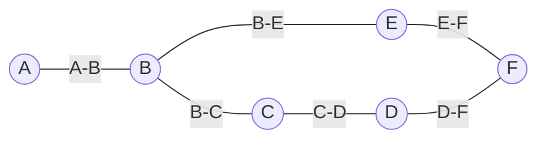
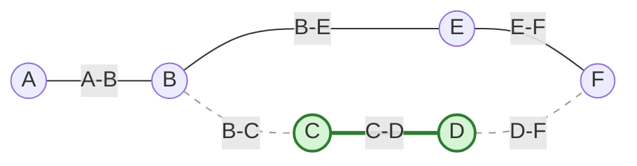
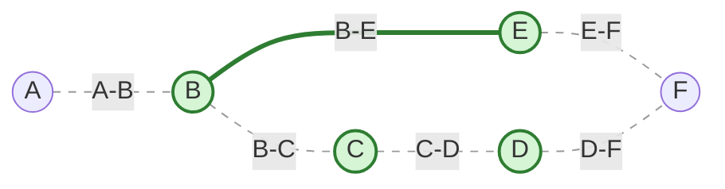

# Algorytm aproksymacyjny pokrycia wierzchołkowego (Approx-Vertex-Cover)

> [!abstract] Cel egzaminacyjny
> Umiem wyjaśnić działanie algorytmu i przejść go krok po kroku na konkretnych danych.

## Problem

**Wejście:** Nieskierowany graf $G = (V, E)$.
**Wyjście:** Zbiór wierzchołków $C \subseteq V$ będący pokryciem wierzchołkowym.
**Co algorytm ma znaleźć / policzyć / skonstruować:** Pokrycie wierzchołkowe, czyli taki zestaw wierzchołków, w którym każda krawędź w grafie ma przynajmniej jeden swój koniec. Algorytm nie znajduje rozwiązania idealnego (optymalnego), ale daje gwarancję, że znaleziony zbiór będzie co najwyżej dwa razy większy od absolutnego minimum (współczynnik aproksymacji = 2).

## Idea

1. Algorytm działa metodą "na rympał" (bardzo zachłannie). Zaczyna z pustym rozwiązaniem $C$.
2. Szuka w grafie jakiejkolwiek krawędzi, która jeszcze nie została pokryta.
3. Gdy znajdzie krawędź, dodaje do rozwiązania **oba** jej końce (wierzchołki $u$ i $v$).
4. Skoro wzięliśmy oba końce tej krawędzi do wyniku, to znaczy, że nie tylko pokryliśmy tę jedną krawędź, ale też *wszystkie inne krawędzie*, które doczepione są do wierzchołka $u$ lub do wierzchołka $v$. Wyrzucamy je więc ze zbioru krawędzi do przetworzenia.
5. Powtarzamy proces tak długo, aż w grafie nie zostanie ani jedna niepokryta krawędź.

## Kiedy stosować

- Problem znalezienia minimalnego pokrycia wierzchołkowego jest problemem NP-trudnym. Oznacza to, że dla dużych grafów nie istnieje algorytm, który znalazłby idealne rozwiązanie w sensownym czasie.
- Stosujemy go w sytuacjach biznesowych lub inżynieryjnych (np. rozmieszczanie kamer na skrzyżowaniach tak, by monitorowały każdą drogę), gdzie zadowala nas "wystarczająco dobre" rozwiązanie, które liczy się błyskawicznie i ma twardą gwarancję bycia gorszym maksymalnie o 100%.

## Pseudokod

```csharp
public HashSet<Vertex> ApproxVertexCover(Graph G) 
{
    // C to nasz wynikowy zbiór wierzchołków
    HashSet<Vertex> C = new HashSet<Vertex>();
    
    // E_prime to zestaw krawędzi, które wciąż musimy pokryć
    // Inicjujemy go wszystkimi krawędziami z grafu
    HashSet<Edge> E_prime = new HashSet<Edge>(G.Edges);

    // Dopóki są jakieś niepokryte krawędzie
    while (E_prime.Count > 0) 
    {
        // 1. Wybierz DOWOLNĄ niepokrytą krawędź
        Edge e = E_prime.First(); 
        
        // 2. Dodaj OBA jej końce do rozwiązania
        C.Add(e.U);
        C.Add(e.V);
        
        // 3. Usuń wszystkie krawędzie (włącznie z 'e'), 
        // które dotykają wierzchołka U lub V
        E_prime.RemoveWhere(edge => 
            edge.U == e.U || edge.U == e.V || 
            edge.V == e.U || edge.V == e.V);
    }

    return C;
}

```

## Przebieg na przykładzie

> [!example] Najważniejsza część notatki
> Ten przykład pokazuje, dlaczego algorytm zwraca suboptymalny wynik, ale nigdy nie przekracza bariery $2 \times$ optimum.

**Dane wejściowe:** Graf reprezentujący np. układ korytarzy, w których chcemy postawić strażników (wierzchołki), by widzieli wszystkie korytarze (krawędzie).
Wierzchołki: `{A, B, C, D, E, F}`
Krawędzie $E'$:

* `(A, B)`
* `(B, C)`
* `(B, E)`
* `(C, D)`
* `(E, F)`
* `(D, F)`

**Kroki algorytmu:**

**Stan początkowy:** Wynik $C = \emptyset$. Do pokrycia $E'$ = wszystkie krawędzie.



**Iteracja 1:**

* Pętla wybiera dowolną krawędź. Załóżmy, że trafia na `(C, D)`.
* Algorytm jest brutalny. Nie zastanawia się. Bierze **oba** końce do wyniku: $C = \{C, D\}$.
* Teraz usuwamy z $E'$ wszystkie krawędzie, które dotykają C lub D. Wylatują: `(C, D)` (ta wylosowana), `(B, C)` (dotyka C), oraz `(D, F)` (dotyka D).
* Pozostały do pokrycia krawędzie $E'$: `(A, B)`, `(B, E)`, `(E, F)`.



**Iteracja 2:**

* Zostały nam 3 krawędzie. Losujemy z nich kolejną. Trafia na `(B, E)`.
* Bierzemy **oba** jej końce do wyniku. Dodajemy B oraz E. Nasz wynik to teraz $C = \{C, D, B, E\}$.
* Usuwamy z $E'$ wszystkie krawędzie dotykające B lub E. Wylatują: `(B, E)` (ta wylosowana), `(A, B)` (dotyka B), oraz `(E, F)` (dotyka E).
* Pula $E'$ jest pusta!



**Wynik:** Algorytm zwraca zbiór $C = \{C, D, B, E\}$.
Rozmiar naszego rozwiązania wynosi 4. Zauważ, że idealne optimum wynosiło 3. Nasz algorytm wyciągnął o jeden wierzchołek za dużo (bo wziął i C, i D, a mógł wziąć tylko D na tamtym etapie), jednak wynik 4 jest mniejszy niż dwukrotność optimum ($4 \le 2 \times 3$). Algorytm zadziałał perfekcyjnie zgodnie z twierdzeniem.

## Złożoność

| Rodzaj     | Złożoność  | Skąd się bierze |
| ---------- | ---------- | --------------- |
| Czasowa    | $O(\|V\|)$ |                 |
| Pamięciowa | $O(\|V\|)$ |                 |

> [!warning] Typowe pułapki
> * Branie tylko jednego wierzchołka krawędzi — studenci często myślą "wezmę jeden koniec krawędzi, to już ją pokryłem, dodam tylko jeden wierzchołek, to wynik będzie mniejszy". Wtedy algorytm **traci gwarancję aproksymacji**, bo ten jeden wierzchołek może być najgorszym z możliwych wyborów (liściem)! Branie obu końców "zakotwicza" matematyczny dowód.
> * Niedokładne usuwanie krawędzi incydentnych — po wrzuceniu krawędzi `(u, v)` do wyniku, musimy skreślić z grafu wszystkie krawędzie, które mają $u$ LUB $v$. Zapomnienie o krawędziach połączonych z $v$ spowoduje nieskończoną pętlę lub błędny wynik.
> 
> 

## Checklista egzaminacyjna

* [ ] podać problem, wejście i wyjście
* [ ] wyjaśnić ideę własnymi słowami
* [ ] zapisać lub odtworzyć pseudokod
* [ ] przejść algorytm na konkretnych danych
* [ ] podać złożoność czasową i pamięciową
* [ ] wskazać typowe pułapki

## Mini-fiszki

**Q:** Co rozwiązuje ten algorytm?

**A:** Szuka aproksymacyjnego pokrycia wierzchołkowego w grafie (zbioru wierzchołków pokrywającego wszystkie krawędzie).

**Q:** Jaka jest główna idea?

**A:** Wylosuj krawędź, weź oba jej końce do wyniku, usuń z grafu wszystkie krawędzie doczepione do tych końców. Powtarzaj aż nie zostanie żadna krawędź.

**Q:** Jaka jest złożoność czasowa i dlaczego?

**A:** `O(|V| + |E|)` przy użyciu listy sąsiedztwa, ponieważ każdą krawędź analizujemy i usuwamy co najwyżej raz w trakcie przechodzenia po sąsiadach wybranych wierzchołków.

**Q:** Jak wygląda pierwszy nietrywialny krok na przykładzie?

**A:** Kiedy losujemy krawędź np. `(C, D)`, wrzucamy do koszyka zarówno C jak i D. Wtedy od razu skreślamy z listy do zrobienia wszystkie krawędzie, z którymi styka się C oraz wszystkie, z którymi styka się D.

## Powiązania i źródła

**Źródła:**

* [[AZ.pdf]] (Algorytmy aproksymacyjne - Algorytm 10)

**Powiązane twierdzenia / pojęcia:**

* [[o współczynniku jakości Approx-Vertex-Cover]] (Twierdzenie 4)
* Problem NP-zupełny