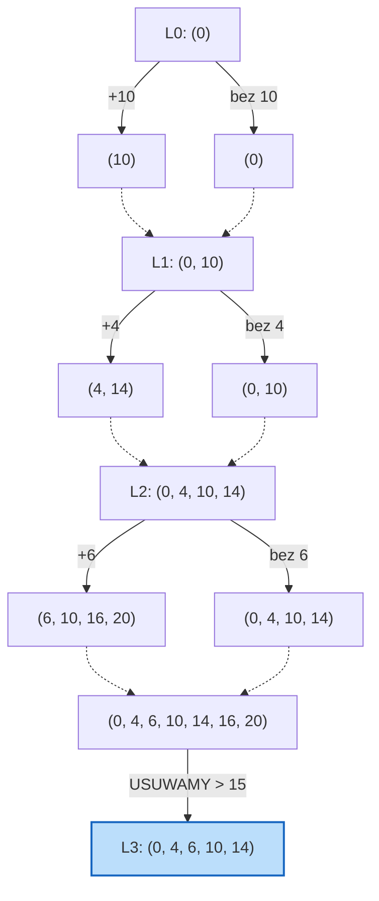

# Algorytm Exact-Subset-Sum (Dokładna suma podzbioru)

> [!abstract] Cel egzaminacyjny
> Umiem wyjaśnić działanie algorytmu i przejść go krok po kroku na konkretnych danych.

## Problem

**Wejście:** Zbiór dodatnich liczb całkowitych $S = \{x_1, x_2, ..., x_n\}$ oraz docelowa wartość (limit) $t$.
**Wyjście:** Największa możliwa suma elementów z jakiegoś podzbioru zbioru $S$, która jest mniejsza lub równa $t$.
**Co algorytm ma znaleźć / policzyć / skonstruować:** Dokładne, optymalne rozwiązanie decyzyjnego/optymalizacyjnego problemu sumy podzbioru (przypominającego problem plecakowy). Szukamy takiego podzbioru liczb, który sumuje się do wartości jak najbliższej $t$, bez jej przekraczania.

## Idea

1. Zamiast sprawdzać losowe kombinacje, budujemy listę wszystkich możliwych sum iteracyjnie. Zaczynamy od pustej sumy, czyli listy zawierającej tylko wartość `(0)`.
2. Bierzemy pierwszą liczbę z wejścia (np. $x_1$). Tworzymy nową listę dodając $x_1$ do wszystkich elementów z naszej dotychczasowej listy.
3. Scalamy starą listę z nową (usuwając duplikaty i zachowując posortowanie). Otrzymujemy listę wszystkich możliwych sum uwzględniających element $x_1$ lub go pomijających.
4. Przed przejściem do kolejnego kroku, usuwamy z połączonej listy wszystkie wartości, które przekraczają nasz limit $t$ (nie ma sensu ich dalej badać, bo dodawanie kolejnych dodatnich liczb tylko pogorszy sytuację).
5. Powtarzamy proces dla każdej liczby z wejścia. Na koniec zwracamy największą liczbę z naszej finalnej listy.

## Kiedy stosować

- Kiedy potrzebujemy **absolutnie optymalnego** dopasowania (np. pakowanie przesyłek do ciężarówki o konkretnej ładowności, z chęcią wykorzystania każdego kilograma).
- Kiedy liczba elementów zbioru ($n$) jest stosunkowo mała. Jest to algorytm o złożoności wykładniczej, dla dużych $n$ list sum urośnie do gigantycznych rozmiarów (dlatego dla większych zbiorów stosuje się algorytm `Approx-Subset-Sum`).

## Pseudokod

```csharp
public int ExactSubsetSum(List<int> S, int t) 
{
    // L_i to nasza lista dotychczasowych możliwych sum
    // Zaczynamy od pojedynczej wartości 0
    List<int> L = new List<int> { 0 };

    foreach (int x in S) 
    {
        // 1. Stwórz listę L_{i-1} + x (dodaj x do każdego elementu z L)
        List<int> L_plus_x = L.Select(val => val + x).ToList();

        // 2. Scal listy (MergeLists w czasie liniowym dla posortowanych list)
        // W C# można to zasymulować przez Union i OrderBy, 
        // ale natywny Merge z dwoma wskaźnikami byłby szybszy (O(N))
        L = L.Union(L_plus_x).OrderBy(val => val).ToList();

        // 3. Usuń wartości przekraczające limit t
        L.RemoveAll(val => val > t);
    }

    // Największa wartość na liście (na końcu posortowanej listy) to nasz wynik
    return L.Max();
}

```

## Przebieg na przykładzie

> [!example] Najważniejsza część notatki
> Obserwuj, jak w każdym kroku bierzemy "starą" listę, tworzymy jej wariant z dodanym nowym elementem i scalamy je w jedną. Przycięcie $> t$ chroni nas przed niepotrzebnymi obliczeniami.

**Dane wejściowe:** $S = \{10, 4, 6, 8\}$, Docelowy limit $t = 15$.

**Kroki algorytmu:**

**Stan początkowy:** Zaczynamy od $L_0 = (0)$.

**Iteracja 1:** Bierzemy $x_1 = 10$.

* Baza z poprzedniego kroku: $L_0 = (0)$.
* Dodajemy 10 do każdego elementu: $L_0 + 10 = (10)$.
* Scalamy: $(0, 10)$.
* Żaden z elementów nie jest $> 15$.
* **$L_1 = (0, 10)$**

**Iteracja 2:** Bierzemy $x_2 = 4$.

* Baza z poprzedniego kroku: $L_1 = (0, 10)$.
* Dodajemy 4 do każdego elementu: $L_1 + 4 = (4, 14)$.
* Scalamy posortowane listy $L_1$ i $(L_1+4)$: $(0, 4, 10, 14)$.
* Żaden element nie przekracza 15.
* **$L_2 = (0, 4, 10, 14)$**

**Iteracja 3:** Bierzemy $x_3 = 6$.

* Baza: $L_2 = (0, 4, 10, 14)$.
* Dodajemy 6: $L_2 + 6 = (6, 10, 16, 20)$.
* Scalamy $(0, 4, 10, 14)$ z $(6, 10, 16, 20)$ pamiętając o deduplikacji.
* Połączona lista: $(0, 4, 6, 10, 14, 16, 20)$.
* **Przycinanie (usuwamy $> 15$):** wylatują 16 i 20.
* **$L_3 = (0, 4, 6, 10, 14)$**

**Iteracja 4:** Bierzemy $x_4 = 8$.

* Baza: $L_3 = (0, 4, 6, 10, 14)$.
* Dodajemy 8: $L_3 + 8 = (8, 12, 14, 18, 22)$.
* Scalamy i deduplikujemy: $(0, 4, 6, 8, 10, 12, 14, 18, 22)$.
* **Przycinanie (usuwamy $> 15$):** wylatują 18 i 22.
* **$L_4 = (0, 4, 6, 8, 10, 12, 14)$**

**Wynik:** Szukamy $\max(L_4)$. Odpowiedź to **14**. Oznacza to, że z elementów $\{10, 4, 6, 8\}$ największa wartość nieprzekraczająca 15 to 14 (osiągana np. przez wzięcie $10 + 4$ lub $6 + 8$).



## Złożoność

| Rodzaj | Złożoność | Skąd się bierze |
| --- | --- | --- |
| Czasowa | `O(\min(2^n, t))` | W najgorszym przypadku z każdą iteracją lista $L_i$ podwaja swoją długość ($1, 2, 4, 8...$), co prowadzi do złożoności wykładniczej $O(2^n)$, gdzie $n$ to liczba elementów. Złożoność jest też ograniczona przez limit $t$, bo długość listy na skutek odcięć nigdy nie przekroczy $t+1$. |
| Pamięciowa | `O(\min(2^n, t))` | W danym momencie w pamięci przechowujemy listy z poprzedniego kroku, których maksymalna długość to $O(2^n)$ lub $O(t)$. |

> [!warning] Typowe pułapki
> * Zapominanie o usuwaniu duplikatów przy scalaniu — jeśli dopuścisz do istnienia wielu tych samych wartości w listach pośrednich, długość listy wystrzeli w kosmos i zepsuje efektywność operacji scalania.
> * Wykonywanie kroku odcięcia "na końcu" — to bardzo częsty błąd. Wszystkie wartości większe niż limit $t$ należy brutalnie odrzucać **na końcu każdej pojedynczej iteracji**, a nie dopiero po wygenerowaniu całej ogromnej tablicy końcowej!
> 
> 

## Checklista egzaminacyjna

* [ ] podać problem, wejście i wyjście
* [ ] wyjaśnić ideę własnymi słowami
* [ ] zapisać lub odtworzyć pseudokod
* [ ] przejść algorytm na konkretnych danych
* [ ] podać złożoność czasową i pamięciową
* [ ] wskazać typowe pułapki

## Mini-fiszki

**Q:** Co rozwiązuje ten algorytm?

**A:** Znajduje maksymalną sumę podzbioru zadanego zbioru liczbowego, która nie przekracza określonego limitu $t$.

**Q:** Jaka jest główna idea?

**A:** Utrzymujemy posortowaną listę możliwych sum. Dla każdego elementu wejściowego tworzymy nową listę sum powiększonych o ten element, scalamy z poprzednią i usuwamy te warianty, które przekroczyły limit $t$.

**Q:** Jak generujemy listę $L_i$?

**A:** Poprzez wzięcie listy z poprzedniego kroku ($L_{i-1}$), dodanie bieżącego elementu $x_i$ do każdej jej wartości i scalenie wynikowej listy ze starą listą ($L_i = Merge(L_{i-1}, L_{i-1} + x_i)$).

**Q:** Jaka jest złożoność czasowa i dlaczego?

**A:** $O(2^n)$ w najgorszym przypadku, ponieważ z każdą rozpatrywaną liczbą lista potencjalnych sum może ulec podwojeniu (jeśli nie ma duplikatów i nie odcinamy zbyt wielu na progu $t$).

## Powiązania i źródła

**Źródła:**

* [[AZ.pdf]] (Algorytmy aproksymacyjne - Algorytm 11: ExactSubsetSum)

**Powiązane twierdzenia / pojęcia:**

* Algorytm Approx-Subset-Sum (wersja z parametrem tolerancji, która spłaszcza złożoność do wielomianowej).
* Problem NP-zupełny (optymalna suma podzbioru to wersja decyzyjnego problemu Knapsack).
