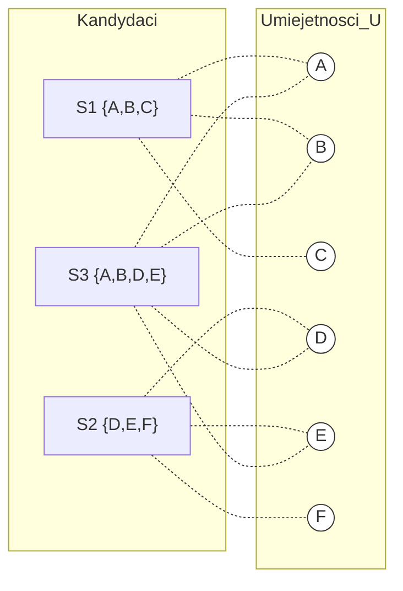
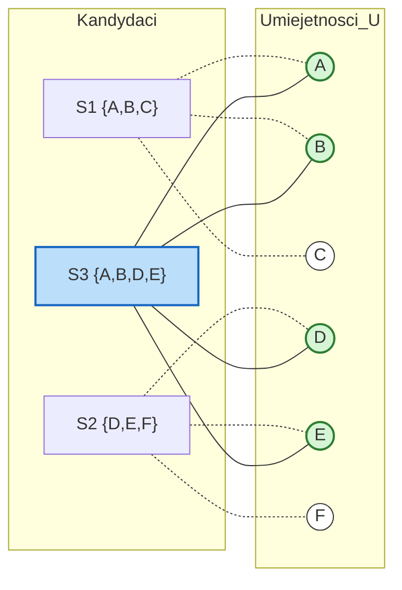
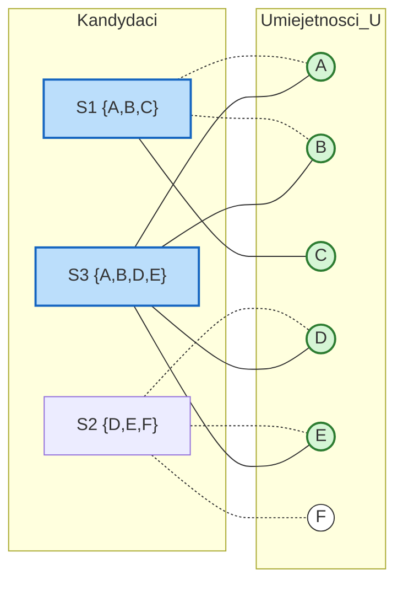
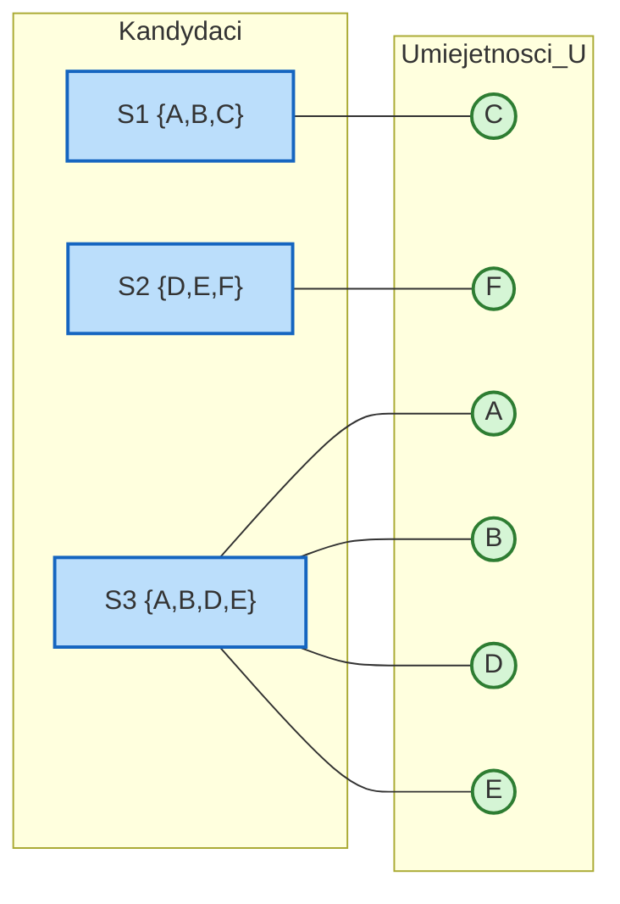

# Algorytm zachłanny pokrycia zbiorowego (Greedy-Set-Cover)

> [!abstract] Cel egzaminacyjny
> Umiem wyjaśnić działanie algorytmu i przejść go krok po kroku na konkretnych danych.

## Problem

**Wejście:** Zbiór wszystkich elementów do pokrycia (uniwersum) $X$ oraz rodzina $\mathcal{F}$ podzbiorów tego uniwersum.
**Wyjście:** Podzbiór rodziny $\mathcal{F}$ (oznaczany jako $\mathcal{C}$), który pokrywa wszystkie elementy w $X$.
**Co algorytm ma znaleźć / policzyć / skonstruować:** Algorytm ma wyznaczyć pokrycie zbiorowe zbliżone do minimalnego. Optimum jest problemem NP-trudnym, więc algorytm działa zachłannie, dając gwarancję aproksymacji na poziomie liczby harmonicznej $H(|S_{max}|)$.

## Idea

1. Zaczynamy z pustym wynikiem $\mathcal{C} = \emptyset$ oraz ze zbiorem elementów niepokrytych $U$, który na początku jest równy całemu uniwersum $X$.
2. W każdej iteracji przeglądamy dostępne w $\mathcal{F}$ zbiory i patrzymy, który z nich ma najwięcej elementów wspólnych z aktualnym zbiorem niepokrytym $U$ (maksymalizujemy wartość $|S \cap U|$).
3. Wybieramy ten "najbardziej opłacalny" zbiór, dodajemy go do naszego rozwiązania $\mathcal{C}$ i wyrzucamy pokryte przez niego elementy ze zbioru $U$.
4. Powtarzamy ten proces, aż wszystkie elementy będą pokryte ($U$ będzie puste).

## Kiedy stosować

- W systemach przydziału kompetencji (mamy projekt wymagający technologii A, B, C, D, E i szukamy minimalnej liczby programistów o różnych stackach technologicznych, by spełnić te wymagania).
- Alokacja zasobów, np. rozmieszczenie minimalnej liczby anten radiowych, aby pokryć listę miast (gdzie każda antena ma określoną strefę zasięgu).
- Gdy problem jest na tyle duży, że szukanie rozwiązania optymalnego potrwałoby lata, a rozwiązanie "wystarczająco dobre" (nie gorsze niż o czynnik logarytmiczny) nas satysfakcjonuje.

## Pseudokod

```csharp
public HashSet<Set> GreedySetCover(HashSet<Element> X, HashSet<Set> F) 
{
    // U to zbiór elementów wciąż oczekujących na pokrycie
    HashSet<Element> U = new HashSet<Element>(X); 
    
    // C to nasze wynikowe pokrycie
    HashSet<Set> C = new HashSet<Set>(); 

    while (U.Count > 0) 
    {
        Set bestSet = null;
        int maxIntersection = -1;

        // Szukamy zbioru z F pokrywającego najwięcej NIEPOKRYTYCH elementów
        foreach (var S in F) 
        {
            // Liczymy elementy z S, które nadal są w U
            int currentIntersection = S.Elements.Count(e => U.Contains(e));
            
            if (currentIntersection > maxIntersection) 
            {
                maxIntersection = currentIntersection;
                bestSet = S;
            }
        }

        // Dodajemy najlepszy zbiór do wyniku
        C.Add(bestSet);
        
        // Aktualizujemy uniwersum wykreślając pokryte elementy
        U.ExceptWith(bestSet.Elements);
    }

    return C;
}

```

## Przebieg na przykładzie

> [!example] Najważniejsza część notatki
> Ten przykład ilustruje, jak algorytm zachłanny wpada w pułapkę. Pokazuje, że choć algorytm w każdym kroku bierze pozornie najlepszą opcję, może ostatecznie wygenerować wynik gorszy od optimum.

**Dane wejściowe:** Uniwersum do pokrycia to umiejętności potrzebne w zespole: $X = \{A, B, C, D, E, F\}$.
Dostępni kandydaci (zbiory):

* **S1** potrafi: `{A, B, C}`
* **S2** potrafi: `{D, E, F}`
* **S3** potrafi: `{A, B, D, E}` (gwiazda zespołu, ale o specyficznych umiejętnościach)

*Dygresja optymalna: Patrząc z góry widzimy, że idealnym pokryciem jest wynajęcie kandydatów S1 i S2. Ich kompetencje idealnie pokrywają całe uniwersum, a rozmiar rozwiązania to 2.*

**Stan początkowy:** Wynik $C = \emptyset$. Niepokryte elementy $U = \{A, B, C, D, E, F\}$.



**Iteracja 1:**

* Algorytm sprawdza pokrycie z niepokrytym $U$:
* S1 pokrywa 3 elementy (A, B, C).
* S2 pokrywa 3 elementy (D, E, F).
* S3 pokrywa **4 elementy** (A, B, D, E).


* Zachłanny algorytm stwierdza: "Biorę S3, bo daje najwięcej!".
* Dołączamy S3 do wyniku $C$.
* Usuwamy A, B, D, E ze zbioru niepokrytych. Pozostaje $U = \{C, F\}$.



**Iteracja 2:**

* Aktualne niepokryte umiejętności to $U = \{C, F\}$.
* Algorytm ponownie bada sytuację:
* S1 może zaoferować pokrycie dla `{C}` (1 nowy element).
* S2 może zaoferować pokrycie dla `{F}` (1 nowy element).


* Remis. Algorytm wybiera dowolny z nich (np. S1).
* Dodajemy S1 do wyniku $C$. Usuwamy C ze zbioru $U$. Zostaje $U = \{F\}$.



**Iteracja 3:**

* Do pokrycia zostało tylko $U = \{F\}$.
* Sprawdzamy: jedynym zbiorem pokrywającym jakikolwiek niepokryty element jest S2.
* Wybieramy S2.
* Usuwamy F ze zbioru $U$. Zbiór niepokrytych elementów $U = \emptyset$. Pętla się kończy.



**Wynik:** Algorytm zwrócił $C = \{S3, S1, S2\}$.
Rozmiar naszego pokrycia wynosi **3**. Optymalnie wystarczyłyby dwa zbiory (S1 i S2). Ulegając pokusie pierwszego kroku (wielki, ale pokrywający się z innymi zbiór S3), algorytm zmuszony był dobrać dwa kolejne zbiory by załatać "dziury" C i F, co poskutkowało rozwiązaniem gorszym, ale wciąż bardzo racjonalnym i zgodnym z matematycznym ograniczeniem.

## Złożoność

| Rodzaj     | Złożoność | Skąd się bierze |
| ---------- | --------- | --------------- |
| Czasowa    | $O(X)$    |                 |
| Pamięciowa | $O(X)$    |                 |

> [!warning] Typowe pułapki
> * Nierozumienie $|S \cap U|$ — musimy zwracać uwagę na liczbę elementów **jeszcze niepokrytych**. Jeśli jakiś zbiór jest ogromny, ale większość jego składowych została już pokryta we wcześniejszych krokach, jego "atrakcyjność" w aktualnej iteracji drastycznie spada.
> * Wybór podczas remisu — algorytm może wybrać w przypadku remisu którykolwiek ze zbiorów (co może wpłynąć na ostateczny rozmiar pokrycia, ale zachowuje aproksymację). Należy pamiętać, by na egzaminie przy remisie konsekwentnie śledzić tylko jeden z wyborów.
> 
> 

## Checklista egzaminacyjna

* [ ] podać problem, wejście i wyjście
* [ ] wyjaśnić ideę własnymi słowami
* [ ] zapisać lub odtworzyć pseudokod
* [ ] przejść algorytm na konkretnych danych
* [ ] podać złożoność czasową i pamięciową
* [ ] wskazać typowe pułapki

## Mini-fiszki

**Q:** Co rozwiązuje ten algorytm?

**A:** Służy do szukania pokrycia zbiorowego (najmniejszej liczby podzbiorów pokrywających wszystkie elementy), dając przybliżone rozwiązanie NP-trudnego problemu optymalnego.

**Q:** Jaka jest główna idea wyboru zachłannego?

**A:** W każdym kroku z dostępnej rodziny podzbiorów wybierz ten, który aktualnie pokrywa największą liczbę wciąż niepokrytych elementów.

**Q:** Na czym polega "pułapka", w którą potrafi wpaść ten algorytm?

**A:** Na wybraniu dużego zbioru, który pokrywa wiele elementów na raz, ale całkowicie ignoruje to, w jaki sposób są ułożone inne zbiory, przez co zmusza nas na końcu do dołożenia wielu drobnych zbiorów, by załatać pojedyncze "dziury".

**Q:** Co oznacza warunek w pętli `while`?

**A:** Działaj tak długo, aż zbiór $U$ (reprezentujący elementy wciąż czekające na pokrycie) nie stanie się pusty.

## Powiązania i źródła

**Źródła:**

* [[AZ.pdf]] (Algorytmy aproksymacyjne - Algorytm 9: GreedySetCover)

**Powiązane twierdzenia / pojęcia:**

* [[o współczynniku jakości Greedy-Set-Cover]] (współczynnik wynosi do $H(\max|S|)$).
* Problemy NP-zupełne.