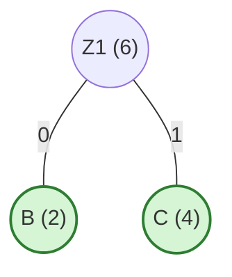
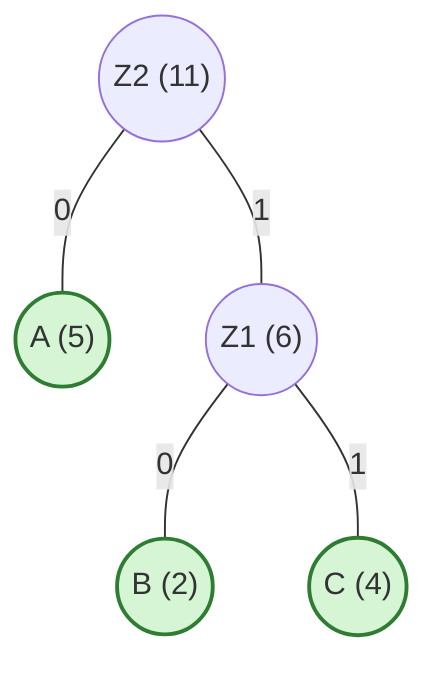
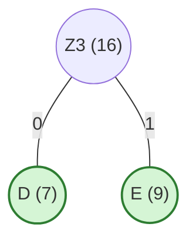
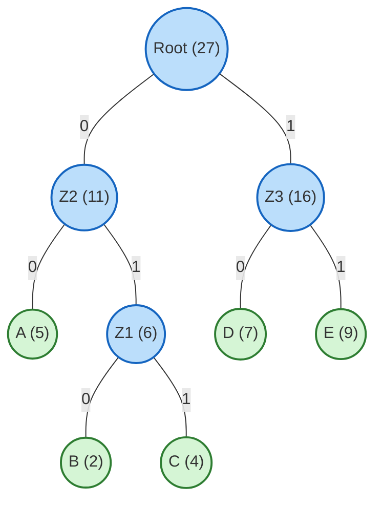

# Algorytm Huffmana (Kodowanie Huffmana)

> [!abstract] Cel egzaminacyjny
> Umiem wyjaśnić działanie algorytmu i przejść go krok po kroku na konkretnych danych.

## Problem

**Wejście:** Zbiór znaków (alfabet) $C$, gdzie każdy znak ma przypisaną częstotliwość występowania (liczbę wystąpień w tekście) $f[x]$.
**Wyjście:** Drzewo prefiksowe (drzewo binarne), które reprezentuje optymalne kodowanie znaków.
**Co algorytm ma znaleźć / policzyć / skonstruować:** Optymalny kod bezstratnej kompresji danych. Algorytm przypisuje krótkie kody binarne znakom, które występują bardzo często, a dłuższe kody znakom rzadkim. Słowo "prefiksowe" oznacza, że żaden kod nie jest początkiem innego kodu, co pozwala na jednoznaczne odkodowanie ciągu zer i jedynek bez używania spacji.

## Idea

1. Algorytm buduje drzewo binarne **od dołu do góry** (od liści do korzenia).
2. Na początku każdy znak to osobny "liść" (drzewo jednoelementowe). Wszystkie liście wrzucamy do kolejki priorytetowej typu Min (gdzie priorytetem jest częstotliwość).
3. W każdej iteracji wyciągamy z kolejki dwa elementy o **najmniejszej** częstotliwości (nazwijmy je $x$ i $y$).
4. Tworzymy dla nich nowy węzeł-rodzica $z$. Jego częstotliwość to suma częstotliwości dzieci ($f[z] = f[x] + f[y]$).
5. Lewym dzieckiem $z$ staje się $x$, a prawym $y$.
6. Wrzucamy nowy węzeł $z$ z powrotem do kolejki priorytetowej.
7. Powtarzamy proces dokładnie $n-1$ razy, aż w kolejce zostanie tylko jeden element – korzeń naszego gotowego drzewa Huffmana.

## Kiedy stosować

- Kompresja bezstratna plików i danych (algorytm ten jest kluczowym elementem formatów takich jak ZIP, GZIP, JPEG, MP3 czy PNG).
- Generowanie kodów o zmiennej długości w telekomunikacji.
- Zawsze, gdy znany jest z góry rozkład prawdopodobieństwa (częstotliwość) występowania poszczególnych symboli w wiadomości.

## Pseudokod

```csharp
public class HuffmanNode 
{
    public char? Symbol { get; set; } // Null dla węzłów wewnętrznych
    public int Frequency { get; set; }
    public HuffmanNode Left { get; set; }
    public HuffmanNode Right { get; set; }
}

public HuffmanNode BuildHuffmanTree(List<HuffmanNode> C) 
{
    int n = C.Count;
    // Kolejka priorytetowa (Min-Heap). Element to węzeł, priorytet to częstotliwość
    PriorityQueue<HuffmanNode, int> Q = new PriorityQueue<HuffmanNode, int>();

    // 1. Inicjalizacja kolejki wszystkimi znakami
    foreach (var node in C) 
    {
        Q.Enqueue(node, node.Frequency);
    }

    // 2. Budowa drzewa (wykonujemy n-1 scaleń)
    for (int i = 1; i <= n - 1; i++) 
    {
        HuffmanNode z = new HuffmanNode();
        
        // Wyciągamy dwa węzły o najmniejszych częstotliwościach
        HuffmanNode x = Q.Dequeue();
        HuffmanNode y = Q.Dequeue();
        
        // Łączymy je nowym korzeniem
        z.Left = x;
        z.Right = y;
        z.Frequency = x.Frequency + y.Frequency;
        
        // Wrzucamy złączone poddrzewo z powrotem do kolejki
        Q.Enqueue(z, z.Frequency);
    }

    // 3. W kolejce został tylko jeden element - korzeń całego drzewa
    return Q.Dequeue();
}

```

## Przebieg na przykładzie

> [!example] Najważniejsza część notatki
> Obserwuj, w jaki sposób węzły o małych częstotliwościach lądują na samym dole drzewa (przez co ich kod będzie najdłuższy), a te częste zostają złączone na samym końcu, lądując blisko korzenia.

**Dane wejściowe:** Alfabet 5 znaków z częstotliwościami:

* **A:** 5
* **B:** 2
* **C:** 4
* **D:** 7
* **E:** 9

**Stan początkowy (Kolejka Q):** Elementy posortowane rosnąco: `[B:2, C:4, A:5, D:7, E:9]`.

**Krok 1:**
Wyciągamy dwa najmniejsze: **B(2)** oraz **C(4)**.
Łączymy je w węzeł $Z_1$ o częstotliwości $2+4 = 6$. Wrzucamy $Z_1$ do kolejki.
Stan kolejki $Q$: `[A:5, Z1:6, D:7, E:9]`.



**Krok 2:**
Wyciągamy dwa najmniejsze: **A(5)** oraz **Z1(6)**.
Łączymy je w węzeł $Z_2$ o częstotliwości $5+6 = 11$. Wrzucamy $Z_2$ do kolejki.
Stan kolejki $Q$: `[D:7, E:9, Z2:11]`.



**Krok 3:**
Wyciągamy dwa najmniejsze: **D(7)** oraz **E(9)**.
Łączymy je w węzeł $Z_3$ o częstotliwości $7+9 = 16$. Wrzucamy $Z_3$ do kolejki.
Stan kolejki $Q$: `[Z2:11, Z3:16]`.



**Krok 4 (Ostatni):**
Zostały tylko dwa elementy w kolejce. Wyciągamy **Z2(11)** oraz **Z3(16)**.
Łączymy je w węzeł $Root$ o częstotliwości $11+16 = 27$ (co stanowi sumę wszystkich znaków).
Kolejka ma 1 element. Koniec algorytmu!



**Odczytywanie kodów:**
Idąc w lewo dodajemy `0`, idąc w prawo dodajemy `1`.
Kody wygenerowane dla znaków to:

* **A:** `00`
* **B:** `010`
* **C:** `011`
* **D:** `10`
* **E:** `11`
*(Zauważ: najrzadszy znak B ma najdłuższy kod - 3 bity, a częste znaki jak E mają tylko 2 bity. Żaden kod nie jest początkiem innego).*

## Złożoność

| Rodzaj | Złożoność | Skąd się bierze |
| --- | --- | --- |
| Czasowa | `O(n log n)` | Inicjalizacja kolejki priorytetowej zajmuje czas $O(n)$. Pętla `for` wykonuje się $n-1$ razy. W każdym kroku wywołujemy operacje `Dequeue` (ściągnięcie minimum) oraz `Enqueue` (dodanie nowego elementu). Operacje na kopcu (Min-Heap) kosztują $O(\log n)$. Zatem $(n-1) \cdot \log n \rightarrow O(n \log n)$. |
| Pamięciowa | `O(n)` | Potrzebujemy pamięci na kolejkę priorytetową (rozmiar maksymalnie $n$) oraz na węzły drzewa (których będzie dokładnie $2n-1$). |

> [!warning] Typowe pułapki
> * Budowanie drzewa "od góry" zamiast "od dołu" — algorytm Huffmana startuje od liści i je ze sobą łączy.
> * Błąd w kolejności wstawiania do kolejki — jeśli po scaleniu dwóch poddrzew zapomnisz wrzucić nowy węzeł do kolejki (lub zrobisz to bez aktualizacji priorytetu oznaczającego sumę), algorytm zawiesi się lub wygeneruje błędne drzewo.
> * Przydzielanie znaków na sztywno do lewej/prawej strony — z punktu widzenia matematycznej długości skompresowanego tekstu nie ma absolutnie żadnego znaczenia, czy węzeł wyciągnięty jako pierwszy stanie się lewym czy prawym dzieckiem złączonego węzła (kody będą się różnić, ale ich długości i właściwość prefiksowości zostaną takie same).
> 
> 

## Checklista egzaminacyjna

* [ ] podać problem, wejście i wyjście
* [ ] wyjaśnić ideę własnymi słowami
* [ ] zapisać lub odtworzyć pseudokod
* [ ] przejść algorytm na konkretnych danych
* [ ] podać złożoność czasową i pamięciową
* [ ] wskazać typowe pułapki

## Mini-fiszki

**Q:** Co rozwiązuje Algorytm Huffmana?

**A:** Generuje optymalne drzewo prefiksowe służące do bezstratnej kompresji danych, w którym najczęściej występujące znaki otrzymują najkrótsze kody.

**Q:** Jakiej głównej struktury danych używa ten algorytm?

**A:** Kolejki priorytetowej typu Min (Min-Priority Queue / Min-Heap), aby zawsze mieć szybki dostęp do dwóch poddrzew o najmniejszej częstotliwości.

**Q:** Ile razy wykonuje się główna pętla łącząca poddrzewa?

**A:** Dokładnie $n-1$ razy (gdzie $n$ to liczba unikalnych znaków), ponieważ każda operacja zmniejsza całkowitą liczbę drzew w lesie o 1, aż zostanie tylko jedno - korzeń.

**Q:** Co to jest "kod prefiksowy"?

**A:** Sposób przypisania ciągów zer i jedynek do znaków w taki sposób, aby kod żadnego znaku nie był początkiem (prefiksem) kodu innego znaku, co eliminuje wieloznaczności przy dekodowaniu.

## Powiązania i źródła

**Źródła:**

* [[AZ.pdf]] (Algorytmy zachłanne - Algorytm 2: Huffmana)

**Powiązane twierdzenia / pojęcia:**

* Algorytmy zachłanne.
* Drzewa binarne i przejścia w drzewach.
* Problem kompresji danych.
