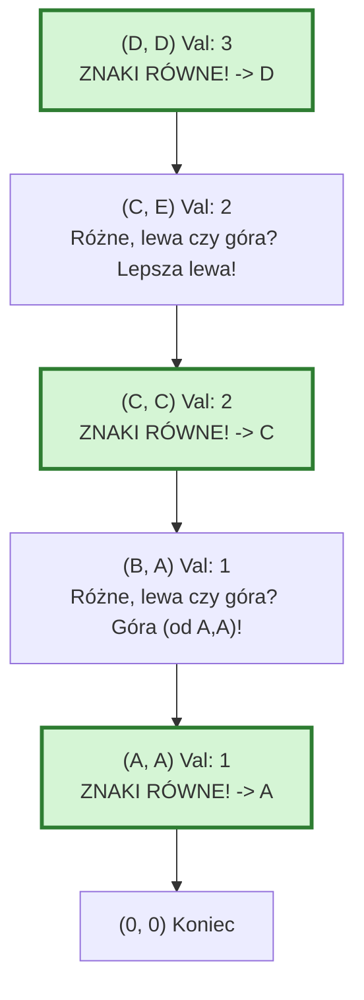

# Najdłuższy wspólny podciąg (Longest Common Subsequence - LCS)

> [!abstract] Cel egzaminacyjny
> Umiem wyjaśnić działanie algorytmu i przejść go krok po kroku na konkretnych danych.

## Problem

**Wejście:** Dwa ciągi znaków (np. stringi, tablice liczb): $X$ o długości $m$ oraz $Y$ o długości $n$.
**Wyjście:** Długość najdłuższego wspólnego podciągu oraz sam ten podciąg.
**Co algorytm ma znaleźć / policzyć / skonstruować:** **Podciąg** to sekwencja elementów, które występują w obu ciągach w tej samej kolejności, ale **niekoniecznie obok siebie** (w przeciwieństwie do podłańcucha/substringa). Np. dla ciągów "ABCD" i "ACED", wspólnym podciągiem jest "ACD". Algorytm szuka najdłuższej takiej sekwencji.

## Idea

1. Stosujemy **programowanie dynamiczne**. Budujemy dwuwymiarową tablicę `dp` o rozmiarach $(m+1) \times (n+1)$. 
2. Komórka `dp[i, j]` przechowuje długość najdłuższego podciągu dla fragmentów (prefiksów) `X[0...i-1]` oraz `Y[0...j-1]`.
3. Zerowy wiersz i zerowa kolumna wypełniane są zerami (jeśli jeden z ciągów jest pusty, to wspólny podciąg ma długość 0).
4. Dla kolejnych komórek porównujemy znaki $X[i-1]$ oraz $Y[j-1]$:
   - **Jeśli są równe:** Zdobyliśmy nowy znak do podciągu! Bierzemy wartość z lewej-górnej po skosie (wartość dla ciągów bez tego znaku) i dodajemy 1. Wzór: `dp[i, j] = dp[i-1, j-1] + 1`.
   - **Jeśli są różne:** Nie zyskaliśmy nowego znaku. Bierzemy najlepsze dotychczasowe rozwiązanie: maksimum z komórki powyżej lub z komórki po lewej. Wzór: `dp[i, j] = max(dp[i-1, j], dp[i, j-1])`.
5. Po wypełnieniu tablicy, w prawym dolnym rogu `dp[m, n]` znajduje się maksymalna długość.
6. Odczytanie samego słowa (Backtracking) polega na cofaniu się od prawego dolnego rogu do początku, wybierając znaki, przy których nastąpiło dopasowanie.

## Kiedy stosować

- Narzędzia do porównywania wersji plików (jak np. polecenie `diff` w Linuksie, na którym opiera się **Git** - szuka najdłuższego wspólnego ciągu linii tekstu).
- Bioinformatyka (porównywanie sekwencji DNA, dopasowywanie genów).
- Systemy autokorekty i wykrywania podobieństwa w tekstach (często w wariancie odległości Levenshteina, z którą LCS jest spokrewniony).

## Pseudokod

```csharp
public string FindLCS(string X, string Y)
{
    int m = X.Length;
    int n = Y.Length;
    int[,] dp = new int[m + 1, n + 1];

    // 1. Wypełnianie tablicy długości podciągów
    for (int i = 1; i <= m; i++)
    {
        for (int j = 1; j <= n; j++)
        {
            if (X[i - 1] == Y[j - 1]) 
            {
                // Znaki równe - wydłużamy podciąg
                dp[i, j] = dp[i - 1, j - 1] + 1;
            }
            else 
            {
                // Znaki różne - bierzemy max z "góry" lub z "lewej"
                dp[i, j] = Math.Max(dp[i - 1, j], dp[i, j - 1]);
            }
        }
    }

    // dp[m, n] zawiera teraz długość najdłuższego podciągu
    int length = dp[m, n];
    char[] lcs = new char[length];
    
    // 2. Odtwarzanie ciągu znaków (Backtracking)
    int r = m, c = n;
    int index = length - 1; // Wypełniamy od końca

    while (r > 0 && c > 0)
    {
        if (X[r - 1] == Y[c - 1])
        {
            // Było dopasowanie - zapisujemy znak i idziemy po skosie w górę i w lewo
            lcs[index] = X[r - 1];
            index--;
            r--; 
            c--;
        }
        else if (dp[r - 1, c] > dp[r, c - 1])
        {
            // Wartość z "góry" była większa, więc z niej przyszliśmy
            r--;
        }
        else
        {
            // Wartość z "lewej" była większa lub równa
            c--;
        }
    }

    return new string(lcs);
}

```

## Przebieg na przykładzie

> [!example] Najważniejsza część notatki
> Ten przykład pokazuje wypełnioną tabelę dla dwóch krótkich ciągów, a schemat Mermaid obrazuje, jak cofnąć się po tablicy, aby odczytać literki.

**Dane wejściowe:** $X$ = "A B C D"
$Y$ = "A C E D"

**Krok 1: Wypełnianie tablicy Programowania Dynamicznego**
Wiersz 0 i kolumna 0 to sztuczne "puste ciągi", więc są pełne zer.

| X \ Y | $\emptyset$ | A | C | E | D |
| --- | --- | --- | --- | --- | --- |
| **$\emptyset$** | 0 | 0 | 0 | 0 | 0 |
| **A** | 0 | **1** | 1 | 1 | 1 |
| **B** | 0 | 1 | 1 | 1 | 1 |
| **C** | 0 | 1 | **2** | 2 | 2 |
| **D** | 0 | 1 | 2 | 2 | **3** |

*Jak to policzyliśmy?* - Spójrz na komórkę C-C (wiersz C, kolumna C). Litery są równe! Więc bierzemy wartość z B-A po skosie (która wynosi 1) i dodajemy 1. Wynik = 2.

* Spójrz na komórkę D-E. Litery są różne (D $\ne$ E). Bierzemy więc maksimum z góry (wartość 2 z C-E) oraz z lewej (wartość 2 z D-C). Wpisujemy 2.

Prawy dolny róg pokazuje nam odpowiedź: **Długość LCS wynosi 3**.

**Krok 2: Odtworzenie wyniku (Backtracking)**
Startujemy z prawego dolnego rogu (D-D, wartość 3). Śledzimy ścieżkę do rogu lewego górnego. Kiedy widzimy, że znaki były takie same, znaczy to, że "odkryliśmy" znak należący do wyniku i idziemy **po skosie**.



**Wynik:** Zbierając znalezione po drodze znaki (czytając od końca), otrzymujemy słowo **"ACD"**.

## Złożoność

| Rodzaj | Złożoność | Skąd się bierze |
| --- | --- | --- |
| Czasowa | `O(m * n)` | Musimy przejść w podwójnej pętli przez wszystkie komórki tablicy `dp`, których jest $(m+1) \times (n+1)$. Operacja wewnątrz pętli zajmuje czas stały $O(1)$. Sam backtracking to pesymistycznie `O(m + n)` kroków. Sumarycznie daje to złożoność kwadratową. |
| Pamięciowa | `O(m * n)` | Musimy przechować całą tablicę 2D niezbędną do odtworzenia słowa w fazie backtrackingu. Jeśli zależałoby nam WYŁĄCZNIE na poznaniu długości, moglibyśmy trzymać w pamięci tylko dwa wiersze naraz (poprzedni i aktualny), zbijając złożoność do $O(\min(m,n))$. |

> [!warning] Typowe pułapki
> * Mylenie podciągu (subsequence) z podłańcuchem (substring) — podciąg nie musi być spójny! Z tego powodu przy literkach równej długości powiększamy wynik po skosie, a nie przerywamy/resetujemy zliczania.
> * Błędy off-by-one w tablicy — zauważ, że dla słów o długości $m$ i $n$, tablica ma rozmiar $m+1 \times n+1$. Zawsze musisz dodać margines zer, żeby warunek sprawdzania z lewej i góry nie wyrzucił `IndexOutOfRangeException` na pierwszej literce.
> * Przypisanie "A = B" w backtrackingu — przy odtwarzaniu wyniku, kiedy litery są różne ($X[r] \ne Y[c]$), jeśli wartości u góry i po lewej są takie same, możesz iść w którąkolwiek ze stron. Często problem LCS posiada więcej niż jedno poprawne rozwiązanie (różne słowa, ale ta sama długość), oba są prawidłowe.
> 
> 

## Checklista egzaminacyjna

* [ ] podać problem, wejście i wyjście
* [ ] wyjaśnić ideę własnymi słowami
* [ ] zapisać lub odtworzyć pseudokod
* [ ] przejść algorytm na konkretnych danych
* [ ] podać złożoność czasową i pamięciową
* [ ] wskazać typowe pułapki

## Mini-fiszki

**Q:** Czym różni się Podciąg (Subsequence) od Podłańcucha (Substring)?

**A:** Podciąg może powstawać przez "wykreślenie" pewnych znaków ze środka i nie musi stanowić zwartego, ciągłego bloku znaków. Podłańcuch to zwarty fragment (bez przerywników).

**Q:** Co robimy w tablicy `dp`, kiedy napotkamy dwa identyczne znaki z obu ciągów?

**A:** Sprawdzamy wartość w komórce lewej-górnej po skosie (reprezentującą najlepszy wynik do momentu dodania tych znaków) i powiększamy ją o 1.

**Q:** Z jakiej części tablicy zaczynamy odtwarzanie właściwego ciągu znaków?

**A:** Od prawego, dolnego rogu (komórka `dp[m, n]`), idąc "pod prąd" decyzji z programowania dynamicznego w stronę lewego, górnego rogu.

**Q:** Jeśli interesuje nas TYLKO i wyłącznie długość wyniku, czy potrzebujemy całej tablicy?

**A:** Nie, wystarczą zaledwie dwa wiersze w pamięci (poprzedni i obecnie wypełniany), ponieważ do wzorów bierzemy dane tylko z aktualnej i bezpośrednio poprzedzającej linii. Wymaga to pamięci $O(\min(m,n))$.

## Powiązania i źródła

**Źródła:**

* Wiedza z zakresu Programowania Dynamicznego (brak bezpośredniego wycinka w `AZ.pdf`, ale paradygmat ten sam co w Matrix-Chain-Order).

**Powiązane twierdzenia / pojęcia:**

* Programowanie Dynamiczne.
* Odległość Levenshteina (Edycja odległości).
* Diff / Git.
