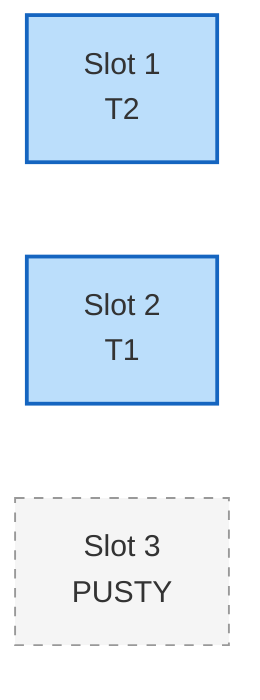
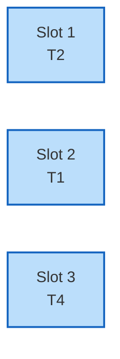

# Algorytm szeregowania zadań (na bazie matroidów)

> [!abstract] Cel egzaminacyjny
> Umiem wyjaśnić działanie algorytmu i przejść go krok po kroku na konkretnych danych.

## Problem

**Wejście:** Zbiór zadań $S$. Każde zadanie zajmuje dokładnie 1 jednostkę czasu, ma swój nieprzekraczalny termin wykonania (deadline) $d_i$ oraz karę $w_i$, którą musimy zapłacić, jeśli zadanie nie zostanie wykonane na czas.
**Wyjście:** Zbiór zadań $A$ (podzbiór $S$), które wykonamy w terminie (tzw. zbiór niezależny).
**Co algorytm ma znaleźć / policzyć / skonstruować:** Maksymalny zbiór niezależny o największej sumie wag (kar). Mówiąc prościej: chcemy ułożyć harmonogram, który pozwoli nam uniknąć największych kar. Odrzucone zadania wykonamy po terminie, płacąc za nie karę.

## Idea

1. Ponieważ ten problem ma udowodnioną strukturę **matroidu**, możemy użyć zachłannego podejścia i mamy 100% gwarancji optymalnego wyniku.
2. Najpierw sortujemy wszystkie zadania malejąco (nierosnąco) według kar $w_i$. Najbardziej zależy nam na uratowaniu tych zadań, za które kary są największe.
3. Przechodzimy przez posortowaną listę i próbujemy "upchnąć" zadanie w naszym harmonogramie. 
4. **Kluczowy trik sprawdzający niezależność:** Aby upewnić się, że zadanie zmieści się w terminie, szukamy dla niego najpóźniejszego wolnego slotu czasowego, który jest $\le d_i$. Jeśli znajdziemy taki slot, przypisujemy tam zadanie. Jeśli wszystkie sloty przed terminem są już zajęte, zadanie odrzucamy (nie da się go uratować).

## Kiedy stosować

- Harmonogramowanie procesorów do zadań o krytycznym czasie wykonania z ustalonymi priorytetami/karami.
- Planowanie produkcji (gdzie każde zlecenie zajmuje dzień, ma deadline i karę umowną za opóźnienie).
- Zawsze, gdy można sprowadzić problem do zadania o jednostkowym czasie trwania i stałej karze za opóźnienie.

## Pseudokod

```csharp
public List<Task> TaskScheduling(List<Task> S) 
{
    // A to zbiór uratowanych zadań (nie spóźnionych)
    List<Task> A = new List<Task>();
    
    // Zakładamy, że znamy maksymalny deadline w całym zbiorze zadań
    int maxDeadline = S.Max(t => t.Deadline);
    
    // Harmonogram - przechowuje informację, jakie zadanie zajmuje dany slot
    // sloty numerujemy od 1 do maxDeadline
    Task[] schedule = new Task[maxDeadline + 1]; 

    // 1. Sortujemy zadania po karach malejąco
    var sortedTasks = S.OrderByDescending(t => t.Penalty).ToList();

    // 2. Przechodzimy przez zadania
    foreach (var task in sortedTasks) 
    {
        // 3. Sprawdzamy, czy można je dołożyć (czy zbiór A + {task} będzie niezależny)
        // Szukamy wolnego slotu od końca (od deadline'u w dół do 1)
        for (int i = task.Deadline; i >= 1; i--) 
        {
            if (schedule[i] == null) // Znaleźliśmy wolny slot!
            {
                schedule[i] = task;
                A.Add(task);
                break; // Zadanie zakolejkowane, wychodzimy z pętli szukania
            }
        }
        // Jeśli pętla dojdzie do 0 i nic nie znajdzie, zadanie jest odrzucane.
    }

    return A;
}

```

## Przebieg na przykładzie

> [!example] Najważniejsza część notatki
> Poniższy przykład obrazuje mechanikę przydzielania zadań "od tyłu" (od deadline'u w dół), co gwarantuje, że nie zablokujemy niepotrzebnie wcześniejszych okienek dla zadań z krótszymi terminami.

**Dane wejściowe:** Mamy 4 zadania (T1, T2, T3, T4). Maksymalny termin to 3.

* **T1:** termin $d=2$, kara $w=50$
* **T2:** termin $d=1$, kara $w=40$
* **T3:** termin $d=2$, kara $w=30$
* **T4:** termin $d=3$, kara $w=20$

**Kroki algorytmu:**

**Krok wstępny:** Sortujemy zadania według kar malejąco.
Kolejność: `[T1(50), T2(40), T3(30), T4(20)]`. Pusty harmonogram:


**Iteracja 1:** Bierzemy zadanie **T1** ($d=2, w=50$).

* Szukamy wolnego slotu, zaczynając od $i=2$ w dół.
* Slot 2 jest wolny. Umieszczamy tam T1.


**Iteracja 2:** Bierzemy zadanie **T2** ($d=1, w=40$).

* Szukamy wolnego slotu, zaczynając od $i=1$ w dół.
* Slot 1 jest wolny. Umieszczamy tam T2.



**Iteracja 3:** Bierzemy zadanie **T3** ($d=2, w=30$).

* Szukamy wolnego slotu, zaczynając od $i=2$ w dół.
* Sprawdzamy Slot 2: Zajęty (przez T1).
* Sprawdzamy Slot 1: Zajęty (przez T2).
* Nie ma wolnych slotów. **T3 zostaje odrzucone** (zapłacimy za nie karę 30). Harmonogram się nie zmienia.

**Iteracja 4:** Bierzemy zadanie **T4** ($d=3, w=20$).

* Szukamy wolnego slotu, zaczynając od $i=3$ w dół.
* Slot 3 jest wolny! Umieszczamy tam T4.



**Wynik:** Zbiór zaakceptowanych zadań $A = \{T1, T2, T4\}$.

* Uratowaliśmy kary rzędu: $50 + 40 + 20 = 110$.
* Zapłacimy tylko karę za T3: $30$.
Harmonogram zadań: w pierwszej jednostce czasu robimy T2, w drugiej T1, w trzeciej T4. T3 robimy po terminie.

> [!warning] Typowe pułapki
> * Wypełnianie slotów "od lewej do prawej" (od okienka nr 1) — to kardynalny błąd! Jeśli wstawisz zadanie z terminem $d=2$ w slot 1, zablokujesz miejsce zadaniu, które ma termin $d=1$ i nie może czekać. Zadania trzeba zawsze "dociskać" w prawo, by trzymać wcześniejsze miejsca wolne.
> * Zapominanie o posortowaniu po wagach (karach) — bez sortowania zniszczymy ideę zachłanności.
## Checklista egzaminacyjna

* [ ] podać problem, wejście i wyjście
* [ ] wyjaśnić ideę własnymi słowami
* [ ] zapisać lub odtworzyć pseudokod
* [ ] przejść algorytm na konkretnych danych
* [ ] podać złożoność czasową i pamięciową
* [ ] wskazać typowe pułapki

## Mini-fiszki

**Q:** Co rozwiązuje ten algorytm?

**A:** Tworzy harmonogram (zbiór niezależny) jednostkowych zadań, minimalizujący karę za niedotrzymanie terminów (maksymalizujący wagę wykonanych).

**Q:** Jaka jest główna idea?

**A:** Sortujemy zadania malejąco po karach i zachłannie próbujemy zakolejkować każde, wpychając je w najpóźniejszy możliwy slot, nie przekraczając jego deadlinu.

**Q:** Dlaczego wpychamy zadania w najpóźniejszy możliwy slot od końca?

**A:** By oszczędzać wcześniejsze sloty (np. nr 1 czy 2) dla zadań, które mają bardzo krótkie terminy wykonania i nie miałyby się gdzie indziej podziać.

**Q:** Jaka jest złożoność czasowa i dlaczego?

**A:** Naiwnie $O(n^2)$ (z powodu pętli szukającej wolnego miejsca dla każdego zadania), ale da się to zoptymalizować do $O(n \log n)$ strukturą Union-Find.

## Powiązania i źródła

**Źródła:**

* [[AZ.pdf]] (Algorytmy zachłanne - Algorytm 3: Szeregowania zadań)

**Powiązane twierdzenia / pojęcia:**

* [[o strukturze problemu szeregowania zadań]]
* [[Matroid]]