# Zachłanny wybór zajęć (Activity Selection Problem)

> [!abstract] Cel egzaminacyjny
> Umiem wyjaśnić działanie algorytmu i przejść go krok po kroku na konkretnych danych.

## Problem

[cite_start]**Wejście:** Zbiór $n$ zajęć/zadań[cite: 1]. [cite_start]Każde zajęcie $i$ posiada określony czas rozpoczęcia $s_i$ oraz czas zakończenia $f_i$[cite: 1].
[cite_start]**Wyjście:** Maksymalny liczbowo zbiór wzajemnie zgodnych zajęć[cite: 1]. Zajęcia są zgodne, jeśli ich przedziały czasowe nie nachodzą na siebie (czyli dla wybranych zajęć $i$ oraz $j$ zachodzi $s_i \ge f_j$ lub $s_j \ge f_i$).
**Co algorytm ma znaleźć / policzyć / skonstruować:** Wybrać jak największą liczbę aktywności, które można zrealizować w ramach jednego zasobu (np. jedna sala wykładowa, jeden procesor jednordzeniowy), nie dopuszczając do konfliktów terminów.

## Idea

1. **Sortowanie:** Kluczem do zachłannego sukcesu jest posortowanie wszystkich zajęć rosnąco według ich **czasów zakończenia ($f_i$)**. Intuicja: chcemy zawsze wybierać zadanie, które skończy się jak najwcześniej, zostawiając jak najwięcej wolnego czasu na kolejne aktywności.
2. [cite_start]**Wybór początkowy:** Zawsze wybieramy pierwsze zajęcie z posortowanej listy[cite: 1]. Kończy się ono najwcześniej ze wszystkich, więc stanowi optymalny start.
3. [cite_start]**Iteracja:** Przeglądamy kolejne zajęcia jedno po drugim[cite: 1]. [cite_start]Jeśli czas rozpoczęcia rozpatrywanego zajęcia jest większy bądź równy czasowi zakończenia *ostatnio zaakceptowanego* zajęcia ($s_i \ge f_j$) [cite: 1][cite_start], to dodajemy je do naszego zbioru i aktualizujemy wskaźnik ostatniego zajęcia[cite: 1]. W przeciwnym wypadku odrzucamy je, ponieważ nakłada się na już zaplanowany blok.

## Kiedy stosować

- Problemy optymalizacji wykorzystania pojedynczego zasobu, gdzie zależy nam wyłącznie na **liczbie** wykonanych zadań (zadania nie mają wag/priorytetów/kosztów).
- Rezerwacja pojedynczej sali konferencyjnej na jak największą liczbę spotkań.
- Planowanie zadań dla bezzałogowego teleskopu (chcemy wykonać jak najwięcej różnych obserwacji w ciągu jednej nocy).

## Pseudokod

```csharp
public class Activity
{
    public string Name { get; set; }
    public int Start { get; set; }
    public int Finish { get; set; }
}

public List<Activity> GreedyActivitySelector(List<Activity> activities)
{
    // 1. Sortujemy zajęcia rosnąco po czasie zakończenia (Finish)
    var sortedActivities = activities.OrderBy(a => a.Finish).ToList();
    
    List<Activity> selectedActivities = new List<Activity>();
    
    if (sortedActivities.Count == 0) return selectedActivities;

    // 2. Pierwsze zajęcie wybieramy zawsze
    Activity lastSelected = sortedActivities[0];
    selectedActivities.Add(lastSelected);

    // 3. Przeglądamy pozostałe zajęcia
    for (int i = 1; i < sortedActivities.Count; i++)
    {
        Activity current = sortedActivities[i];
        
        // Jeśli czas startu jest większy lub równy zakończeniu poprzedniego
        if (current.Start >= lastSelected.Finish)
        {
            selectedActivities.Add(current);
            lastSelected = current; // Aktualizujemy ostatnio wybrane zajęcie
        }
    }

    return selectedActivities;
}

```

## Przebieg na przykładzie

> [!example] Najważniejsza część notatki
> Poniższy przykład pokazuje, w jaki sposób sortowanie po czasie zakończenia pozwala nam błyskawicznie "odfiltrować" zajęcia, które zbyt długo blokowałyby nasz zasób.

**Dane wejściowe (już posortowane rosnąco po czasie zakończenia):**

* **Z1**: (1, 4)
* **Z2**: (3, 5)
* **Z3**: (0, 6)
* **Z4**: (5, 7)
* **Z5**: (3, 9)
* **Z6**: (5, 9)
* **Z7**: (8, 11)

**Harmonogram startowy (Wszystkie potencjalne zajęcia):**

```mermaid
gantt
    title Oś czasu potencjalnych zajęć
    dateFormat  X
    axisFormat %H:%M
    
    Z1 (1, 4) :active, z1, 1, 4
    Z2 (3, 5) : z2, 3, 5
    Z3 (0, 6) : z3, 0, 6
    Z4 (5, 7) : z4, 5, 7
    Z5 (3, 9) : z5, 3, 9
    Z6 (5, 9) : z6, 5, 9
    Z7 (8, 11) : z7, 8, 11

```



**Kroki algorytmu:**

**Stan początkowy:** Wynik $A = \emptyset$. Ostatni czas zakończenia `lastFinish = 0`.

**Krok 1:** Rozpatrujemy **Z1** (1, 4).

* Pierwsze zajęcie jest wybierane automatycznie ($1 \ge 0$).
* Dodajemy Z1 do wyniku. `lastFinish` zmienia się na **4**.

```mermaid
gantt
    title Krok 1: Wybór Z1
    dateFormat  X
    axisFormat %H:%M
    
    Z1 (1, 4) :done, z1, 1, 4
    Z2 (3, 5) : z2, 3, 5
    Z3 (0, 6) : z3, 0, 6
    Z4 (5, 7) : z4, 5, 7
    Z5 (3, 9) : z5, 3, 9
    Z6 (5, 9) : z6, 5, 9
    Z7 (8, 11) : z7, 8, 11

```



**Krok 2:** Rozpatrujemy **Z2** (3, 5) oraz **Z3** (0, 6).

* Dla Z2: `Start` wynosi 3. Sprawdzamy: $3 \ge 4$ $\rightarrow$ **FAŁSZ**. Z2 nakłada się na Z1. Odrzucamy.
* Dla Z3: `Start` wynosi 0. Sprawdzamy: $0 \ge 4$ $\rightarrow$ **FAŁSZ**. Z3 nakłada się na Z1. Odrzucamy.

**Krok 3:** Rozpatrujemy **Z4** (5, 7).

* `Start` wynosi 5. Sprawdzamy: $5 \ge 4$ $\rightarrow$ **PRAWDA**. Brak konfliktu!
* Dodajemy Z4 do wyniku. `lastFinish` zmienia się na **7**.

```mermaid
gantt
    title Krok 3: Wybór Z4 (Z2 i Z3 odrzucone)
    dateFormat  X
    axisFormat %H:%M
    
    Z1 (1, 4) :done, z1, 1, 4
    Z2 (3, 5) :crit, z2, 3, 5
    Z3 (0, 6) :crit, z3, 0, 6
    Z4 (5, 7) :done, z4, 5, 7
    Z5 (3, 9) : z5, 3, 9
    Z6 (5, 9) : z6, 5, 9
    Z7 (8, 11) : z7, 8, 11

```



**Krok 4:** Rozpatrujemy **Z5** (3, 9) oraz **Z6** (5, 9).

* Dla Z5: $3 \ge 7$ $\rightarrow$ **FAŁSZ**. Odrzucamy.
* Dla Z6: $5 \ge 7$ $\rightarrow$ **FAŁSZ**. Odrzucamy.

**Krok 5:** Rozpatrujemy **Z7** (8, 11).

* `Start` wynosi 8. Sprawdzamy: $8 \ge 7$ $\rightarrow$ **PRAWDA**. Brak konfliktu!
* Dodajemy Z7 do wyniku. `lastFinish` zmienia się na **11**.

```mermaid
gantt
    title Wynik Końcowy (Z5 i Z6 odrzucone)
    dateFormat  X
    axisFormat %H:%M
    
    Z1 (1, 4) :done, z1, 1, 4
    Z2 (3, 5) :crit, z2, 3, 5
    Z3 (0, 6) :crit, z3, 0, 6
    Z4 (5, 7) :done, z4, 5, 7
    Z5 (3, 9) :crit, z5, 3, 9
    Z6 (5, 9) :crit, z6, 5, 9
    Z7 (8, 11) :done, z7, 8, 11

```



**Wynik:** Maksymalny zbiór niezależnych zajęć to **{Z1, Z4, Z7}**. Udało nam się zrealizować 3 kompletne zajęcia bez żadnych konfliktów.

## Złożoność

| Rodzaj | Złożoność | Skąd się bierze |
| --- | --- | --- |
| Czasowa | `O(n log n)` | Dominującą operacją jest wstępne posortowanie $n$ zajęć po czasie zakończenia ($O(n \log n)$). Sama pętla przechodząca przez zajęcia wykonuje się w czasie ściśle liniowym $O(n)$ , ponieważ każde zadanie sprawdzamy dokładnie raz. Podsumowując: $O(n \log n) + O(n) = O(n \log n)$.

 |
| Pamięciowa | `O(n)` | Musimy przechować wejściową oraz posortowaną listę struktur danych reprezentujących zajęcia, a także listę wynikową. |

> [!warning] Typowe pułapki
> * **Sortowanie po niewłaściwym parametrze:** Sortowanie po czasie *rozpoczęcia* ($s_i$) albo po *czasie trwania* ($f_i - s_i$) **nie gwarantuje** optymalnego wyniku globalnego. Gwarancję daje wyłącznie zachłanny wybór oparty na posortowaniu po czasie *zakończenia* ($f_i$).
> * **Porównywanie ze złym wskaźnikiem:** Nowo rozpatrywane zadanie musimy zawsze porównywać z czasem zakończenia **ostatnio wybranego (zaakceptowanego) zadania**, a NIE z zadaniem stojącym bezpośrednio przed nim w tablicy.
> * **Obsługa punktów styku:** Pamiętaj, że warunek $s_i \ge f_j$ dopuszcza sytuację, w której jedno zajęcie zaczyna się dokładnie w tej samej jednostce czasu, w której poprzednie się kończy (np. jedno kończy się o 4, a kolejne zaczyna o 4). To jest sytuacja w pełni poprawna.
> 
> 

## Checklista egzaminacyjna

* [ ] podać problem, wejście i wyjście
* [ ] wyjaśnić ideę własnymi słowami
* [ ] zapisać lub odtworzyć pseudokod
* [ ] przejść algorytm na konkretnych danych
* [ ] podać złożoność czasową i pamięciową
* [ ] wskazać typowe pułapki

## Mini-fiszki

**Q:** Na jakiej podstawie algorytm zachłanny dokonuje wyboru kolejnych zajęć?

**A:** Na podstawie jak najwcześniejszego czasu zakończenia zadania ($f_i$). Sortujemy rosnąco po $f_i$ i bierzemy pierwsze pasujące zadanie.

**Q:** Jaki jest warunek bezkonfliktowości nowego zadania z obecnym harmonogramem?

**A:** Czas rozpoczęcia nowego zadania musi być większy lub równy czasowi zakończenia ostatnio dodanego zadania ($s_i \ge f_{\text{last}}$).

**Q:** Dlaczego sortowanie po najkrótszym czasie trwania zadania (Shortest Job First) zawodzi w tym problemie?

**A:** Ponieważ krótkie zadanie umieszczone niefortunnie w środku osi czasu może zablokować dwa inne, niewiele dłuższe zadania, które idealnie wypełniłyby boki harmonogramu.

**Q:** Jaka jest złożoność czasowa algorytmu, jeśli na wejściu dostaniemy tablicę, która jest już posortowana po czasach zakończenia?

**A:** Wynosi wtedy $O(n)$ , ponieważ musimy jedynie wykonać jeden przebieg pętli `for` w celu weryfikacji warunków nakładania się zadań.

## Powiązania i źródła

**Źródła:**

* [[AZ.pdf]] (Algorytmy zachłanne - Algorithm 1: Zachłanny wyboru zajęć)

**Powiązane twierdzenia / pojęcia:**

* Własność zachłannego wyboru (Greedy Choice Property).
* Problem optymalnej podstruktury.
* Szeregowanie zadań na bazie matroidów (wersja z karami i jednostkowym czasem).
