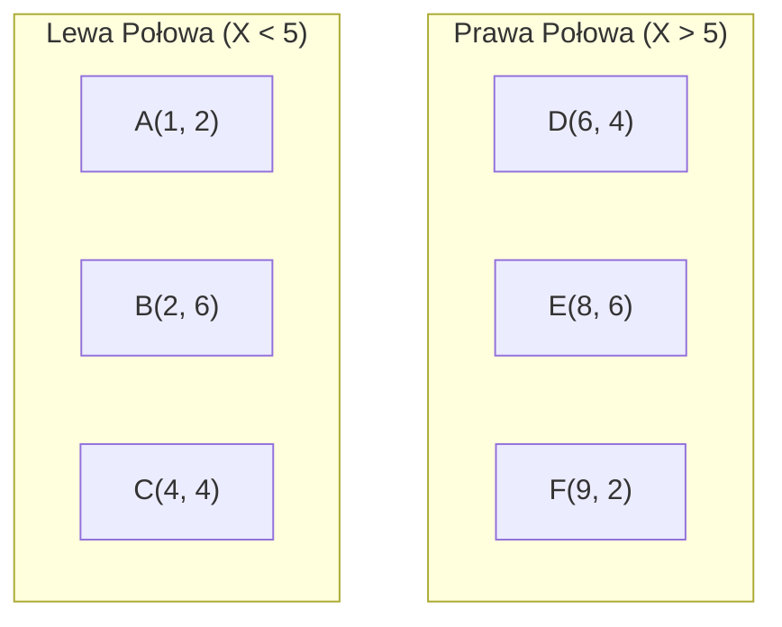
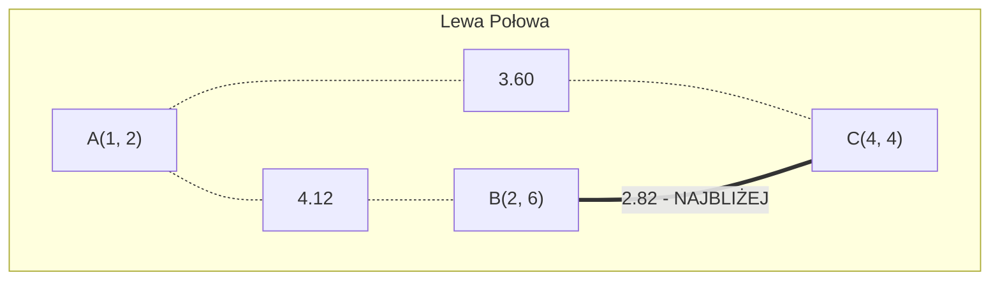
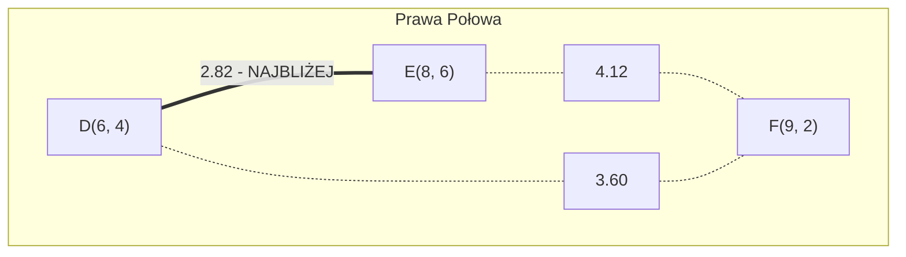
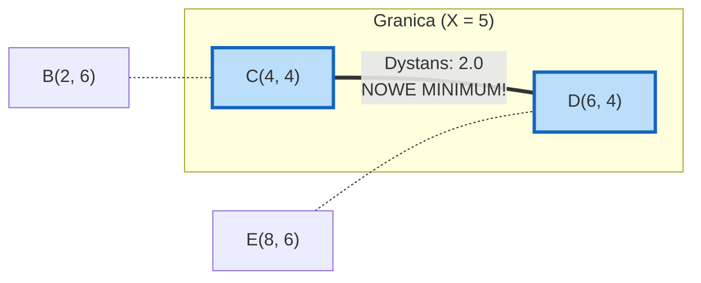

# Algorytm znajdujący parę najbliższych punktów (Dziel i Zwyciężaj)

> [!abstract] Cel egzaminacyjny
> Umiem wyjaśnić działanie algorytmu i przejść go krok po kroku na konkretnych danych.

## Problem

**Wejście:** Zbiór $n$ punktów na płaszczyźnie 2D (współrzędne $X$ i $Y$).
**Wyjście:** Dwa punkty, dla których odległość euklidesowa jest najmniejsza spośród wszystkich możliwych par.
**Co algorytm ma znaleźć / policzyć / skonstruować:** Minimalny dystans $\delta$ oraz parę punktów, która ten dystans generuje, zbijając przy tym kwadratowy czas wykonania (metoda brute-force) do poziomu $O(n \log n)$.

## Idea

1. **Sortowanie wstępne:** Na samym początku przygotowujemy dwie tablice z naszymi punktami: jedną posortowaną po współrzędnej $X$, drugą po współrzędnej $Y$.
2. **Dziel:** Znajdujemy pionową prostą $l$, która dzieli zbiór punktów dokładnie na dwie równe (lub prawie równe) połowy: lewą ($P_L$) i prawą ($P_R$).
3. **Zwyciężaj (Rekursja):** Wywołujemy ten sam algorytm rekurencyjnie dla lewej i prawej połowy. Otrzymujemy minimalną odległość z lewej strony ($\delta_L$) oraz z prawej strony ($\delta_R$). Bierzemy mniejszą z nich: $\delta = \min(\delta_L, \delta_R)$.
4. **Połącz:** Pozostaje nam sprawdzić, czy nie istnieje jakaś para punktów leżąca **na granicy** (jeden punkt w lewej połowie, drugi w prawej), która jest bliżej siebie niż $\delta$. 
5. Aby to zrobić, tworzymy pionowy "pas" o szerokości $2\delta$ (po $\delta$ w lewo i prawo od osi podziału). Zbieramy punkty z tego pasa (z posortowanej tablicy Y) i dla każdego z nich sprawdzamy odległość tylko z **7 kolejnymi punktami** (to matematycznie udowodniony limit dla tego obszaru).

## Kiedy stosować

- Systemy radarowe, kontrola lotów (wykrywanie obiektów, które znalazły się niebezpiecznie blisko siebie).
- Symulacje fizyczne i silniki gier (kolizje cząsteczek).
- Analiza klastrów w machine learningu (odnajdywanie najbardziej podobnych do siebie rekordów w dwuwymiarowej przestrzeni cech).

## Pseudokod

```csharp
public (Point, Point, double) ClosestPair(List<Point> P) 
{
    // Krok 1: Wstępne sortowanie całego zbioru (odbywa się tylko raz!)
    var pointsX = P.OrderBy(p => p.X).ToList();
    var pointsY = P.OrderBy(p => p.Y).ToList();
    
    return ClosestPairRecursive(pointsX, pointsY);
}

private (Point, Point, double) ClosestPairRecursive(List<Point> Px, List<Point> Py) 
{
    int n = Px.Count;

    // Przypadek brzegowy: dla małej liczby punktów liczymy siłowo (brute-force)
    if (n <= 3) return BruteForceClosestPair(Px);

    // Krok 2: DZIEL
    int mid = n / 2;
    Point midPoint = Px[mid];
    
    // Rozdzielamy tablice na lewą i prawą stronę
    var Lx = Px.Take(mid).ToList();
    var Rx = Px.Skip(mid).ToList();
    
    var Ly = Py.Where(p => p.X <= midPoint.X).ToList();
    var Ry = Py.Where(p => p.X > midPoint.X).ToList();

    // Krok 3: ZWYCIĘŻAJ
    var (p1L, p2L, deltaL) = ClosestPairRecursive(Lx, Ly);
    var (p1R, p2R, deltaR) = ClosestPairRecursive(Rx, Ry);

    // Wybieramy minimum z obu stron
    double delta = Math.Min(deltaL, deltaR);
    var closestPair = deltaL < deltaR ? (p1L, p2L) : (p1R, p2R);

    // Krok 4: POŁĄCZ (Sprawdzanie pasa na granicy)
    // Filtrujemy punkty, których odległość od linii podziału jest mniejsza niż delta
    var strip = Py.Where(p => Math.Abs(p.X - midPoint.X) < delta).ToList();

    for (int i = 0; i < strip.Count; i++) 
    {
        // Sprawdzamy maksymalnie 7 kolejnych punktów w pasie
        for (int j = i + 1; j < strip.Count && (strip[j].Y - strip[i].Y) < delta; j++) 
        {
            double dist = Distance(strip[i], strip[j]);
            if (dist < delta) 
            {
                delta = dist;
                closestPair = (strip[i], strip[j]);
            }
        }
    }

    return (closestPair.Item1, closestPair.Item2, delta);
}

```

## Przebieg na przykładzie

> [!example] Najważniejsza część notatki
> Ten przykład udowadnia, dlaczego krok sprawdzania "pasa granicznego" jest absolutnie niezbędny. Pokazuje sytuację, w której algorytm w lewej połowie uważa, że znalazł minimum, w prawej też, ale to właśnie krawędź łącząca obie połówki okazuje się najkrótsza.

**Dane wejściowe:** Mamy 6 punktów na płaszczyźnie.

* A = (1, 2)
* B = (2, 6)
* C = (4, 4)
* D = (6, 4)
* E = (8, 6)
* F = (9, 2)

**Krok 1: Podział (DZIEL)**
Sortujemy po współrzędnej X i dzielimy równo na pół (po 3 punkty). Linia podziału $l$ wypada pomiędzy punktem C(4,4) a D(6,4), powiedzmy na $X = 5$.



**Krok 2: Rekursja (ZWYCIĘŻAJ w lewej połowie)**
Liczymy siłowo odległości w podzbiorze {A, B, C}:

* Odległość A-B: $\sqrt{(2-1)^2 + (6-2)^2} = \sqrt{1 + 16} \approx 4.12$
* Odległość A-C: $\sqrt{(4-1)^2 + (4-2)^2} = \sqrt{9 + 4} \approx 3.60$
* **Odległość B-C: $\sqrt{(4-2)^2 + (4-6)^2} = \sqrt{4 + 4} \approx 2.82$**
Mamy minimum z lewej: $\delta_L = 2.82$ (Para B-C).



**Krok 3: Rekursja (ZWYCIĘŻAJ w prawej połowie)**
Liczymy siłowo odległości w podzbiorze {D, E, F}:

* Odległość E-F: $\sqrt{(9-8)^2 + (2-6)^2} = \sqrt{1 + 16} \approx 4.12$
* Odległość D-F: $\sqrt{(9-6)^2 + (2-4)^2} = \sqrt{9 + 4} \approx 3.60$
* **Odległość D-E: $\sqrt{(8-6)^2 + (6-4)^2} = \sqrt{4 + 4} \approx 2.82$**
Mamy minimum z prawej: $\delta_R = 2.82$ (Para D-E).



**Krok 4: Pas Graniczny (POŁĄCZ)**
Mamy $\delta = \min(2.82, 2.82) = 2.82$.
Nasza linia podziału to $X = 5$.
Tworzymy pionowy pas o szerokości $2\delta$, czyli wyłapujemy wszystkie punkty o współrzędnej $X$ pomiędzy $(5 - 2.82)$ a $(5 + 2.82)$.
Pas obejmuje zakres $X \in [2.18, 7.82]$.
W tym pasie łapią się dokładnie dwa punkty z naszego zbioru: **C(4, 4)** oraz **D(6, 4)**.

Odległość między C i D to po prostu w poziomie: $\sqrt{(6-4)^2 + (4-4)^2} = 2.0$.
Wartość $2.0 < \delta$ (2.82). Zatem to punkty graniczne okazują się być najbliższą parą w całym układzie!



**Wynik:** Najbliższą parą są punkty C i D z odległością 2.0.

## Złożoność

| Rodzaj | Złożoność | Skąd się bierze |
| --- | --- | --- |
| Czasowa | `O(n log n)` | Dzielenie zbioru przypomina MergeSort. Mamy $\log n$ poziomów rekursji. Dzięki wcześniejszemu posortowaniu po Y (i rozdzielaniu tej listy w czasie liniowym), etap łączenia w każdym węźle kosztuje $O(n)$. Równanie rekurencyjne to $T(n) = 2T(n/2) + O(n)$, co daje $O(n \log n)$. |
| Pamięciowa | `O(n log n)` lub `O(n)` | Zależnie od implementacji. Trzymanie pod-tablic w rekursji wymaga pamięci. Da się to zoptymalizować do $O(n)$ operując na referencjach/indeksach. |

> [!warning] Typowe pułapki
> * Sortowanie tablicy po $Y$ od nowa w każdym kroku rekursji — to drastycznie psuje złożoność z $O(n \log n)$ do $O(n \log^2 n)$. Sortowanie po obu współrzędnych musi nastąpić tylko RAZ przed wejściem w rekursję.
> * Zapomnienie o przerywaniu sprawdzania pętli po Y — pętla dla pasa granicznego musi sprawdzać odległości "w dół" tylko o dystans $\delta$ (lub wprost do 7 kolejnych sąsiadów z posortowanej tabeli). Sprawdzanie każdego punktu w pasie z każdym innym zniszczyłoby wydajność.
> * Próba dzielenia 1 lub 2 punktów — rekursja musi mieć warunek brzegowy dla $\le 3$ punktów. W przeciwnym razie wpadniemy w Infinite Loop (punkt nie może mieć odległości sam ze sobą).
> 
> 

## Checklista egzaminacyjna

* [ ] podać problem, wejście i wyjście
* [ ] wyjaśnić ideę własnymi słowami
* [ ] zapisać lub odtworzyć pseudokod
* [ ] przejść algorytm na konkretnych danych
* [ ] podać złożoność czasową i pamięciową
* [ ] wskazać typowe pułapki

## Mini-fiszki

**Q:** Co rozwiązuje ten algorytm?

**A:** Znajduje najmniejszą odległość (i generujące ją punkty) z minimalizacją złożoności czasowej z $O(n^2)$ na $O(n \log n)$.

**Q:** Jaka jest główna idea?

**A:** Używa paradygmatu Dziel i Zwyciężaj: dzieli płaszczyznę na pół pionową linią, rekurencyjnie szuka minimum w lewej i prawej połówce, a na koniec sprawdza "pas graniczny".

**Q:** Dlaczego w pasie granicznym sprawdzamy tylko do 7 punktów?

**A:** Gwarantują to właściwości geometryczne: w prostokącie z którego pochodzą punkty (wymiary $\delta \times 2\delta$), nie fizycznie można upchać więcej niż 8 punktów (po 4 z każdej strony), zachowując między nimi dystans co najmniej $\delta$.

**Q:** Jaka jest złożoność czasowa i dlaczego?

**A:** $O(n \log n)$, o ile posortujemy punkty po osi Y przed całą rekursją i jedynie sprytnie "rozdzielamy" tę listę podczas podziałów.

## Powiązania i źródła

**Źródła:**

* [[AZ.pdf]] (Algorytmy Dziel i Zwyciężaj - Część 0.3)

**Powiązane twierdzenia / pojęcia:**

* Twierdzenie [[o poprawności algorytmu znajdującego parę najbliższych punktów]] (ograniczenie do 7 sprawdzanych sąsiadów).
* Paradygmat Dziel i Zwyciężaj.
* Równanie rekurencyjne (Master Theorem).
